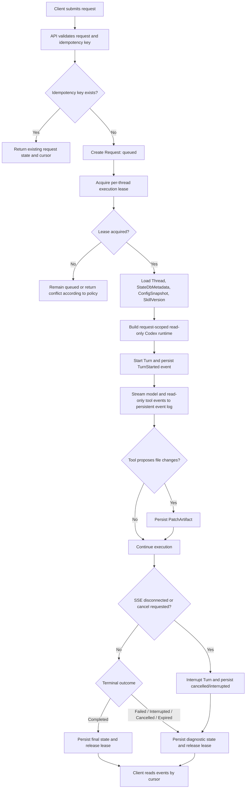

# Codex CLI 无状态服务需求设计

## 1. 业务场景说明

REQ-001 的业务场景是将 Codex CLI 能力提供给云端服务调用方。目标部署形态为几十到上百个 Codex 服务实例。客户端不保持与同一服务实例的长期会话绑定；每次用户输入被建模为一次独立请求。后续请求可命中任意兼容实例，并基于云端持久化状态恢复线程上下文后继续执行。

| 要素 | 内容 | 来源类型 |
| --- | --- | --- |
| 参与方 | 本地 CLI 用户、IDE 或桌面客户端、自动化系统、Codex 服务实例、云端状态存储、只读 exec-server、NFS Skill 源 | 需求来源 |
| 触发条件 | 调用方提交一次用户输入、查询请求状态、读取事件、取消运行中请求或刷新 Skill 缓存 | 需求来源 |
| 当前问题 | Codex CLI 当前同时承担交互入口、会话生命周期管理、本地状态读写、工具执行编排和 UI 输出；该模型适合单用户本地终端，不适合多实例服务化 | 需求来源 |
| 期望结果 | 服务实例不依赖进程内长期会话状态完成跨请求正确性；线程、turn、请求、事件、配置快照、Skill 指纹、PatchArtifact 等关键状态可从云端状态恢复；所有执行环境严格只读 | 需求来源 |
| 发生频率 | 每次用户输入均形成一次请求；自动化系统可高频提交非交互请求 | 推断 |
| 数据对象 | Thread、Request、Turn、Event、ConfigSnapshot、StateDbMetadata、SkillVersion、SkillCacheEntry、ThreadWriterLease、PatchArtifact、ExecObservation | 推断 |
| 异常路径 | 实例退出、客户端断线、云端状态存储不可用、NFS 不可用、取消请求、只读执行环境拒绝写入、运行中工具不可恢复 | 需求来源 |
| 运营约束 | 首个版本不要求运行中任务跨实例接管，不支持运行中 SSE 断线重新 attach，不启用 sub-agent，不要求 PTY、shell session、MCP 会话跨实例恢复；执行环境不得写入本地、远程 workspace 或 NFS Skill 源 | 需求来源 |

## 2. 目标

### 2.1 总体目标

REQ-002：将 Codex CLI 从以本地交互进程为中心的形态，改造成可由外部客户端按请求调用的无状态服务入口。服务实例不得依赖进程内长期会话状态完成跨请求正确性；请求所需上下文必须由请求参数、云端持久化状态或可重建资源提供。

### 2.2 具体目标

| ID | 目标 | 成功标准 | 来源类型 |
| --- | --- | --- | --- |
| REQ-003 | 支持外部客户端提交单次对话请求、查询请求状态、流式读取结果、取消运行中请求 | 对应接口具备稳定请求、响应、错误和事件模型；运行中 SSE 断线触发当前 turn 取消，不支持重新 attach | 需求来源 |
| REQ-004 | 支持任意兼容实例处理同一线程的后续请求 | 第 N 次请求完成后，第 N+1 次请求命中其他实例仍可恢复上下文 | 需求来源 |
| REQ-005 | 将长生命周期对话模型迁移为单次请求模型 | 请求结束后，后续请求不依赖进程内 `CodexThread`、thread map 或 context cache | 需求来源 |
| REQ-006 | 明确区分请求状态、可持久化业务状态和临时运行状态 | 每类状态有所有者、持久化策略和失效语义 | 需求来源 |
| REQ-007 | 保留本地 CLI 命令入口 | 本地 CLI 可作为服务客户端或服务兼容入口；迁移期可保留必要本地执行路径 | 需求来源 |
| REQ-008 | 支持集中式 NFS Skill 源和服务实例本地缓存 | Skill 加载具备版本指纹、完整性校验、TTL、主动刷新和缓存状态观测 | 需求来源 |
| REQ-009 | 提供严格只读 Runtime | App-Server 主机、远程 exec-server workspace、Skill 根目录、检索挂载和临时目录均不得被工具或模型驱动能力写入；允许写入的边界仅限云端状态存储和云端 artifact 存储 | 需求来源 |
| REQ-010 | 将文件修改能力表达为云端 PatchArtifact | `apply_patch` 类能力不得直接修改执行环境文件系统；模型只能产生可审计、可下载、可后续应用的 patch artifact | 需求来源 |

## 3. 范围边界

### 3.1 当前版本范围

- 定义无状态服务的产品和系统需求边界。
- 定义 Thread、Request、Turn、Event、ConfigSnapshot、SkillVersion、ThreadWriterLease、ReadOnlyExecEnvironment、PatchArtifact 等核心实体和状态。
- 定义请求进入、恢复上下文、执行 turn、写入事件、完成持久化、释放进程内对象的生命周期要求。
- 定义云端状态存储、事件终态后读取、幂等重试、同线程串行化、取消、严格只读执行环境、PatchArtifact 和 Skill 缓存的需求。
- 定义与现有 app-server `thread/start`、`thread/resume`、`turn/start` 模型的兼容性约束。

### 3.2 非目标

- 不要求移除 Codex 的所有持久化数据。无状态服务表示服务进程不持有不可替代的业务状态，不表示系统不使用云端数据库、文件存储、对象存储或 NFS。
- 不要求首个版本提供多租户 SaaS 能力，但数据模型必须预留租户或调用方关联字段。
- 不要求首个版本重写模型调用。工具执行、shell、process、filesystem、MCP 和 patch 相关能力必须收敛到严格只读 Runtime 边界，不能保留绕过边界的本地写入路径。
- 不要求改变现有 Codex CLI 的全部用户命令语义；兼容性按迁移阶段定义。
- 不要求将全部交互式 TUI 能力完整映射为远程服务能力。
- 不要求首个版本实现跨地域 Skill 分发；NFS 可作为单区域共享源。
- 不要求运行中任务跨实例接管。运行中任务可以绑定到创建或调度它的 owner 实例。
- 不要求当前 Runtime 设计覆盖审批编排、租户、外围 Session 管理和 Web 端通知。审批可作为外部 MCP 阻塞调用或外围系统能力处理，本需求仅要求 Runtime 不因审批而引入不可迁移的进程内业务状态。
- 不要求 PTY、shell session、MCP 会话跨实例恢复。实例失效时，相关临时运行状态可中断或失败。
- 不支持运行中 SSE 断线后的重新 attach。SSE 断线时，owner 实例应取消当前 running turn，并将终态写入云端状态。
- 不启用 sub-agent 或多 agent 编排能力。相关工具、插件或内部入口需要在云端 Runtime 配置中关闭或不注册。
- 不允许任何执行环境写入。云端状态存储和云端 artifact 存储是 Runtime 的持久化边界，不属于模型可执行环境。
- 不将 Claude Code 类似 `print/single-run mode` 视为完整无状态化的充分条件。该模式每次调用只执行一个 turn，并在 turn 结束后释放本次 session 对象；它可以降低进程内 session 驻留，但不能替代 CloudThreadStore、云端 state_db、writer lease 和只读执行边界。当前 Codex CLI 中 `-p` 已表示 `--profile`，因此如果复用 `-p` 表达 single-run，需要在 CLI 兼容设计中单独决策。

## 4. 现状分析

### 4.1 当前线程与会话模型

当前 `ThreadManagerState` 持有 `HashMap<ThreadId, Arc<CodexThread>>`。`send_op` 通过 `get_thread` 查找进程内线程后提交操作。因此，当前运行态请求处理依赖进程内线程映射。[代码证据：`codex-rs/core/src/thread_manager.rs`](../../../../codex-rs/core/src/thread_manager.rs)

当前 `Codex` 持有 `tx_sub`、`rx_event`、`session` 和后台 `session_loop_termination`。`Codex::submit` 为一次提交生成 ID 后发送到 `tx_sub`，由后台 session loop 处理。因此，当前 turn 执行路径是长生命周期 session 内的提交队列模型。[代码证据：`codex-rs/core/src/session/mod.rs`](../../../../codex-rs/core/src/session/mod.rs)

### 4.2 当前 app-server 协议模型

现有 v2 协议已包含 `thread/start`、`thread/resume`、`turn/start`、`turn/steer`、`turn/interrupt`、`thread/turns/list` 和 `thread/turns/items/list`。`TurnStartParams` 以 `thread_id` 和 `input` 为核心输入，`TurnStartResponse` 返回 `Turn`。现有 `TurnStatus` 为 `Completed`、`Interrupted`、`Failed`、`InProgress`。[代码证据：`codex-rs/app-server-protocol/src/protocol/v2/turn.rs`](../../../../codex-rs/app-server-protocol/src/protocol/v2/turn.rs)

现有协议没有独立的 `Request` 外层资源，也没有 `queued`、`cancelling`、`cancelled`、`expired` 等请求级状态。引入无状态请求模型时，必须明确 `Request` 与现有 `Turn` 的关系。[推断]

### 4.3 当前持久化模型

当前 thread store 支持 `LocalThreadStore` 和 `InMemoryThreadStore`。本地 thread store 依赖本地 rollout 目录和可选 SQLite state runtime。`state` crate 使用 SQLite migration 管理 thread metadata、goals、memory、logs 等本地状态。[代码证据：`codex-rs/core/src/thread_manager.rs`](../../../../codex-rs/core/src/thread_manager.rs)、[`codex-rs/state/src/migrations.rs`](../../../../codex-rs/state/src/migrations.rs)

`ThreadMetadata` 包含本地 rollout path、cwd、model、approval mode、sandbox policy、token usage、git 信息等字段。该结构是后续云端 thread metadata 的重要输入来源，但其中 `rollout_path` 是本地路径，不可作为跨实例业务状态的唯一索引。[代码证据：`codex-rs/state/src/model/thread_metadata.rs`](../../../../codex-rs/state/src/model/thread_metadata.rs)

### 4.4 当前 Skill 加载与缓存模型

当前 app-server `SkillsWatcher` 监听本地 skill root 变化，触发 `skills_manager.clear_cache()` 并发送 `SkillsChangedNotification`。当前行为是进程内缓存失效，不具备 NFS 权威源、版本指纹、TTL、完整性校验和缓存状态 API。[代码证据：`codex-rs/app-server/src/skills_watcher.rs`](../../../../codex-rs/app-server/src/skills_watcher.rs)

### 4.5 当前上下文与模型调用约束

当前 `ModelClientSession` 被定义为 turn-scoped，并缓存 Responses WebSocket 和 sticky routing token。该状态仅应在同一 turn 内复用，不应跨 turn 复用。[代码证据：`codex-rs/core/src/client.rs`](../../../../codex-rs/core/src/client.rs)

### 4.6 当前可写执行面与严格只读 Runtime 冲突

当前 app-server 文档暴露了多类可能写入执行环境的能力：`thread/shellCommand` 被标注为 unsandboxed full access；`command/exec`、`process/spawn`、`fs/writeFile`、`fs/createDirectory`、`fs/remove`、`fs/copy` 等接口可直接作用于本地或远程环境；默认 agent prompt 仍要求使用 `apply_patch` 修改文件。[代码证据：`codex-rs/app-server/README.md`](../../../../codex-rs/app-server/README.md)、[`codex-rs/protocol/src/prompts/base_instructions/default.md`](../../../../codex-rs/protocol/src/prompts/base_instructions/default.md)

因此，仅将 `ThreadStore` 改为云端实现不能满足严格只读 Runtime。必须保证所有模型可调用的文件系统、shell、process、patch、skill script、hook 和 MCP 能力都不能写入 App-Server 主机、exec-server workspace、NFS Skill 源或检索挂载。允许写入的对象仅限云端状态存储和云端 artifact 存储；这些写入必须由 Runtime 系统代码完成，而不是模型可执行环境完成。[推断]

### 4.7 当前 `codex exec` 生命周期能力

当前 `codex exec` 是非交互 CLI 入口。执行时它会启动 in-process app-server client，调用 `thread/start` 或 `thread/resume`，随后调用 `turn/start` 并等待终态。进程退出后，in-process app-server、`CodexThread`、listener 和本次 turn 内部对象会随进程释放。[代码证据：`codex-rs/exec/src/lib.rs`](../../../../codex-rs/exec/src/lib.rs)

该能力可作为迁移期的单次进程适配方式，但不等价于云端 Runtime 无状态化。原因包括：默认持久化仍可能落在本地 session 或 state_db；进程退出不自动提供 CloudThreadStore、云端事件日志、云端 PatchArtifact、writer lease、跨实例 resume 或严格只读执行边界。[推断]

如果新增 Claude Code 类似的 `print/single-run mode`，且实现为每次调用启动独立进程、执行一个 turn、写入云端状态后退出，则进程内 Session 状态会自然释放。如果该模式实现为长驻 App-Server 内部的请求 flag，则必须在 turn 终态后显式 release `CodexThread`、listener、tool runtime 和 request-scoped session；不能依赖参数语义自动释放。[推断]

## 5. 结合实际代码的可行性分析

### 5.1 可复用能力

- 现有 app-server v2 JSON-RPC 协议可作为服务接口基线。[代码证据]
- 现有 `thread/start`、`thread/resume`、`turn/start`、`turn/interrupt`、`thread/turns/list` 可作为无状态服务接口的兼容基础。[代码证据]
- 现有 rollout item 到 `Turn` 的构建逻辑可作为历史恢复和事件重放的输入参考。[代码证据：`codex-rs/app-server-protocol/src/protocol/thread_history.rs`](../../../../codex-rs/app-server-protocol/src/protocol/thread_history.rs)
- 现有 `ThreadStore` trait 可作为引入 cloud-backed thread store 的扩展点。[代码证据]
- 现有 `StateRuntime` 数据模型可作为云端 state metadata 迁移清单来源。[代码证据]

### 5.2 必须新增或扩展的能力

- 新增云端状态存储抽象，覆盖 Thread、Request、Turn、Event、ConfigSnapshot、StateDbMetadata、SkillVersion、ThreadWriterLease、PatchArtifact。[推断]
- 新增请求级 `Request` 资源，或明确将请求状态折叠进 `Turn` 的兼容方案。[推断]
- 新增同线程串行化和 owner 实例租约机制，避免多实例并发执行同一线程 turn。[推断]
- 扩展 `ThreadStore` 写入接口或其调用上下文，使 `append_items` 具备 writer lease、fencing token 和幂等键校验；当前 `AppendThreadItemsParams` 仅包含 `thread_id` 和 `items`，不足以表达多实例写入仲裁。[代码证据]
- 新增事件持久化和游标读取能力，用于终态后读取完整事件；运行中 SSE 断线不支持重新 attach，应触发当前 Request/Turn 取消。[需求来源]
- 新增幂等键存储和重复请求判定规则。[推断]
- 新增 NFS Skill 权威源、本地缓存、版本指纹、TTL、完整性校验和主动刷新接口。[推断]
- 新增严格只读 Runtime profile，并将所有 command/exec、process、filesystem、patch、skill script、hook、MCP 工具调用收敛到该 profile。[需求来源]
- 新增只读 exec-server 运行模式。`command/exec` 可保留为只读脚本执行能力，但必须强制路由到只读 exec-server，且禁止回退到 App-Server 主机执行。[需求来源]
- 新增 PatchArtifact 输出路径，替代直接 `apply_patch` 写入 workspace。模型产出的代码变更应作为云端 artifact 持久化，而不是应用到任一执行环境。[需求来源]

### 5.3 主要冲突

| ID | 冲突 | 影响 | 处理要求 | 来源类型 |
| --- | --- | --- | --- | --- |
| C-001 | 当前 `send_op` 依赖进程内 `CodexThread` | 后续请求不能任意实例恢复执行 | `turn/run` 或等价接口必须在请求内 load/resume，执行结束后 persist/release | 代码证据 |
| C-002 | 当前 `TurnStatus` 与需求中的请求状态不一致 | 状态查询和客户端重试语义不明确 | 定义 RequestStatus 与 TurnStatus 映射，或扩展协议状态 | 代码证据 |
| C-003 | 当前 SQLite state runtime 是本地状态 | 多实例状态不一致 | 将 state_db 元数据迁移到云端 DB 或云端状态服务 | 代码证据 |
| C-004 | 当前 Skill watcher 是本地文件监听与进程内缓存失效 | 无法满足 NFS 缓存可追溯性和跨实例一致性 | 引入 SkillVersion 和 SkillCacheEntry 模型 | 代码证据 |
| C-005 | 当前 app-server 存在 `thread/shellCommand`、`process/spawn` 和 `fs/writeFile` 等可写或 unsandboxed 能力 | 执行环境可写会使 App-Server 或 exec-server workspace 成为状态节点，破坏任意节点迁移前提 | 云端 Runtime 必须不注册、禁用或重路由这些可写能力；所有执行环境使用只读挂载或只读权限 profile | 代码证据 |
| C-006 | 默认 prompt 指示模型使用 `apply_patch` 直接修改文件 | 与严格只读 Runtime 冲突 | 改为生成 PatchArtifact 或结构化 edit proposal，不直接修改 workspace | 代码证据 |
| C-007 | 当前 `command/exec` 可与远程 exec-server 结合，但未要求只读 workspace 或禁止本地 fallback | 远程 workspace 一旦可写即成为有状态执行节点 | exec-server 必须提供只读 workspace 和只读临时目录策略；App-Server 必须拒绝本地 fallback | 推断 |
| C-008 | 当前 `codex exec` 的进程退出可释放进程内对象，但不自动云端化持久状态 | 不能仅靠每 Turn 启动 CLI 进程满足无状态服务 | `codex exec` 仅可作为迁移期适配层；核心 Runtime 仍需 CloudThreadStore、云端 state_db、writer lease 和只读执行边界 | 代码证据 |

## 6. 实体、主要流程图、关键状态和状态闭环分析

### 6.1 实体

| ID | 实体 | 说明 | 持久化要求 | 来源类型 |
| --- | --- | --- | --- | --- |
| ENT-001 | Thread | 逻辑会话，跨请求 resume 的主业务对象 | 云端持久化；以 `threadId` 查询 | 需求来源 |
| ENT-002 | Request | 一次客户端提交的服务请求，承载幂等键、调用方、输入摘要和状态 | 云端持久化；以 `requestId` 和 `idempotencyKey` 查询 | 推断 |
| ENT-003 | Turn | 一次模型执行轮次，可由 Request 创建或驱动 | 云端持久化；以 `turnId` 查询 | 代码证据 |
| ENT-004 | Event | 请求或 turn 产生的结构化输出事件 | 云端持久化；按请求内序号和游标读取 | 需求来源 |
| ENT-005 | PatchArtifact | 模型提出的文件修改或代码变更产物 | 云端 artifact 存储；绑定 requestId、turnId、threadId 和内容哈希 | 需求来源 |
| ENT-006 | ConfigSnapshot | 本次请求使用的配置解析结果或可重建配置输入 | 云端持久化；绑定 Request 和 Thread | 需求来源 |
| ENT-007 | StateDbMetadata | 现有 state_db 承载的 thread metadata、goal、memory mode、backfill state 等元数据 | 云端 DB 或云端状态服务 | 需求来源 |
| ENT-008 | SkillVersion | Skill 权威源路径、Skill ID、版本指纹、解析状态 | 云端持久化；绑定 Request 使用记录 | 需求来源 |
| ENT-009 | SkillCacheEntry | 服务实例本地 Skill 缓存记录 | 本地可丢弃；状态可观测 | 需求来源 |
| ENT-010 | OwnerLease | 运行中请求的 owner 实例租约 | 云端持久化；用于取消、超时和失败诊断 | 推断 |
| ENT-011 | ThreadWriterLease | 同线程写入租约和 fencing token | 云端持久化；所有 Thread append 和 Request 状态写入必须校验 | 推断 |
| ENT-012 | ReadOnlyExecEnvironment | 只读脚本执行环境，通常由 exec-server 提供 | 不持久化；workspace、Skill 源、检索挂载和临时目录不可写 | 需求来源 |
| ENT-013 | ExecObservation | 只读命令、检索或脚本执行的结构化观察结果 | 作为 Event 或 ToolOutput 持久化 | 推断 |

### 6.2 主要流程图

### 6.3 关键状态

#### 6.3.1 RequestStatus

| ID | 状态 | 状态所有者 | 进入条件 | 退出条件 | 允许后继状态 | 来源类型 |
| --- | --- | --- | --- | --- | --- | --- |
| ST-001 | queued | 云端 Request 记录 | 请求通过校验但尚未获得执行租约 | 获得租约或超时 | running, expired, cancelled | 推断 |
| ST-002 | running | owner 实例和云端 Request 记录 | 获得同线程执行租约并开始构建只读运行上下文 | 完成、失败、取消、SSE 断线、租约超时 | completed, failed, cancelled, interrupted, expired | 需求来源 |
| ST-003 | cancelling | owner 实例和云端 Request 记录 | 客户端取消、SSE 断线或外部调度要求终止 | 中断确认或执行竞态完成 | completed, failed, cancelled, interrupted | 推断 |
| ST-004 | completed | 云端 Request 记录 | Turn 正常完成且关键状态写入成功 | 无 | 无 | 需求来源 |
| ST-005 | failed | 云端 Request 记录 | 模型、只读工具、配置、环境、持久化或内部错误不可继续 | 无 | 无 | 需求来源 |
| ST-006 | cancelled | 云端 Request 记录 | 调用方取消或 SSE 断线触发取消，且取消被确认 | 无 | 无 | 需求来源 |
| ST-007 | interrupted | 云端 Request 记录 | owner 实例退出、临时运行状态丢失或不可恢复中断 | 无 | 无 | 需求来源 |
| ST-008 | expired | 云端 Request 记录 | queued、running 或 cancelling 超过租约或超时策略 | 无 | 无 | 需求来源 |

#### 6.3.2 TurnStatus 映射

| RequestStatus | 现有 TurnStatus 映射 | 说明 | 来源类型 |
| --- | --- | --- | --- |
| queued | 无直接映射 | Request 外层状态；Turn 可能尚未创建 | 推断 |
| running | InProgress | Turn 已创建且执行中 | 代码证据 |
| cancelling | InProgress 或 Interrupted | Turn 正在中断；当前协议无 Cancelling，需用 Request 外层状态表达 | 推断 |
| completed | Completed | Turn 正常完成 | 代码证据 |
| failed | Failed | Turn 失败 | 代码证据 |
| cancelled | Interrupted 或新增 Cancelled | 当前协议无 Cancelled，需决策 | 代码证据 |
| interrupted | Interrupted | Turn 被中断 | 代码证据 |
| expired | Failed 或新增 Expired | 当前协议无 Expired，需决策 | 代码证据 |

### 6.4 状态闭环分析

| 场景 | 闭环规则 | 来源类型 |
| --- | --- | --- |
| 幂等重试 | 相同调用方、线程和幂等键命中已存在 Request 时，不创建新 Request 或 Turn；返回原 Request 当前状态和 latest cursor | 推断 |
| 客户端断线 | running Request 不支持重新 attach；owner 实例应触发 Turn interrupt，并最终写入 cancelled、interrupted 或 failed；终态事件可通过 cursor 读取 | 需求来源 |
| 服务实例异常退出 | 已完成写入的事件和状态可查询；运行中不可恢复状态进入 interrupted 或 expired | 需求来源 |
| 云端状态写入失败 | 不得向调用方确认 completed；请求进入 failed 或保持可诊断的非终态等待恢复 | 需求来源 |
| 取消请求 | 取消操作幂等；最终进入 cancelled、failed 或 completed，取决于取消与执行完成的竞态判定规则 | 推断 |
| 同线程并发请求 | 默认串行化；后续请求 queued，或按协议返回冲突；不得并发修改同一 Thread 上下文 | 需求来源 |
| NFS 不可用 | 缓存未过期且校验通过时可继续；缓存过期或校验失败时返回结构化错误 | 需求来源 |
| Skill 更新并发 | 运行中请求继续使用启动时绑定指纹；新请求加载最新可见版本 | 需求来源 |
| 执行环境写入尝试 | 写入 App-Server 主机、exec-server workspace、NFS Skill 源、检索挂载或临时目录的操作必须失败并形成结构化工具错误；不得产生持久化执行环境副作用 | 需求来源 |
| Patch 产物生成 | 模型提出的文件修改写入 PatchArtifact；是否应用 patch 属于 Runtime 外部流程，不在当前执行环境内完成 | 需求来源 |

## 7. 功能点列表

| ID | 来源类型 | 功能点 | 参与方 | 优先级 | 输入 | 输出 | 影响范围 | 依赖 | 验收标准 |
| --- | --- | --- | --- | --- | --- | --- | --- | --- | --- |
| FR-001 | 需求来源 | 单次请求提交 | 客户端、服务实例 | P0 | threadId 或 createThread、input、cwd、settings、permissionProfile、idempotencyKey | requestId、turnId、threadId、status、eventCursor | app-server API、ThreadManager、ThreadStore | FR-002、FR-003 | AC-001：合法请求创建 Request；AC-002：重复幂等键不创建重复 Turn |
| FR-002 | 推断 | 请求级幂等 | 客户端、云端状态存储 | P0 | callerId、threadId、idempotencyKey | 已有 Request 或新建 Request | 云端状态模型 | 云端唯一约束 | AC-003：客户端重试不会重复执行已确认请求 |
| FR-003 | 需求来源 | 任意节点 resume | 服务实例、云端状态存储 | P0 | threadId、Request 输入、ConfigSnapshot、StateDbMetadata、SkillVersion | 等价模型上下文 | ThreadStore、context builder、state service | FR-004、FR-006 | AC-004：第 N+1 次请求命中其他实例可继续执行 |
| FR-004 | 需求来源 | 云端状态持久化 | 服务实例、云端状态存储 | P0 | Thread、Request、Turn、Event、ConfigSnapshot、StateDbMetadata、SkillVersion、PatchArtifact | 可查询状态、事件和 artifact | state crate、thread store、rollout history | 云端 DB 或状态服务 | AC-005：删除本地缓存后仍可查询已确认状态 |
| FR-005 | 需求来源 | 事件持久化与游标读取 | 客户端、服务实例 | P0 | requestId、turnId、cursor、limit | events、nextCursor | app-server event pipeline | FR-004 | AC-006：终态后客户端可从 cursor 读取已持久化事件；运行中 SSE 断线不支持重新 attach |
| FR-006 | 需求来源 | 同线程串行化与 owner 租约 | 服务实例、云端状态存储 | P0 | threadId、requestId、ownerInstanceId、leaseTtl | lease 状态 | scheduler、state service | FR-004 | AC-007：同一线程默认不会并发执行两个 running Request |
| FR-007 | 需求来源 | 取消运行中请求 | 客户端、owner 实例 | P1 | requestId、turnId、reason | terminal status | turn interrupt、tool runtime | FR-006 | AC-008：取消操作幂等并写入最终状态 |
| FR-008 | 需求来源 | 严格只读 Runtime | 模型、服务实例、exec-server | P0 | readOnlyRuntimeProfile、execServerEnvironment、permissionProfile | 只读工具结果或结构化写入拒绝错误 | app-server tools、exec-server、sandbox、MCP、hooks | FR-004、FR-006 | AC-009：所有执行环境写入尝试失败，且不会改变 App-Server 主机、exec-server workspace、NFS Skill 源或检索挂载 |
| FR-009 | 需求来源 | CLI 兼容入口 | 本地 CLI 用户 | P1 | `codex exec` 输入、print/single-run mode 输入、服务地址或内嵌服务配置 | 等价退出状态和结构化结果 | CLI、app-server client | FR-001 | AC-010：非交互 CLI 可经服务路径完成；若引入 `-p` 表示单次执行模式，需解决当前 `-p` 已作为 `--profile` 的兼容性冲突 |
| FR-010 | 需求来源 | NFS Skill 加载 | 服务实例、NFS | P1 | skillRoot、skillId、request scope | SkillVersion、load errors | SkillsManager、SkillsWatcher | NFS 权威源 | AC-011：请求记录实际使用的 Skill 指纹 |
| FR-011 | 需求来源 | Skill 本地缓存与失效 | 服务实例 | P1 | sourcePath、versionFingerprint、TTL、cachePolicy | SkillCacheEntry、cacheStatus | skill cache manager | FR-010 | AC-012：缓存失效后新请求使用更新指纹 |
| FR-012 | 需求来源 | 结构化错误和观测 | 运维、客户端 | P1 | traceId、requestId、error kind | error code、metrics、logs | app-server、state service、skill cache | FR-004 | AC-013：错误区分用户、权限、环境、模型和内部错误 |
| FR-013 | 需求来源 | PatchArtifact 输出 | 模型、服务实例、云端 artifact 存储 | P0 | proposedPatch、targetPaths、baseRevision、requestId、turnId | patchArtifactId、contentHash、metadata | apply_patch 替代路径、event log、artifact store | FR-004、FR-008 | AC-014：模型提出的文件变更写入 PatchArtifact，不直接修改执行环境文件系统 |
| FR-014 | 需求来源 | 运行中 SSE 断线取消 | 客户端、owner 实例 | P0 | requestId、turnId、disconnectReason | cancelled/interrupted/failed terminal status | SSE transport、turn interrupt、state service | FR-005、FR-007 | AC-015：运行中 SSE 断线后，服务端不允许重新 attach 到原 Turn，并最终写入终态 |
| FR-015 | 推断 | Thread writer lease 与 fencing | 服务实例、云端状态存储 | P0 | threadId、requestId、fencingToken、appendIdempotencyKey | append success 或 fencing conflict | ThreadStore、state service | FR-003、FR-004、FR-006 | AC-016：过期 owner 或非 owner 实例不能追加同一 Thread 的 canonical items |

## 8. 角色与权限

| 角色 | 允许操作 | 禁止操作 | 权限失败行为 | 来源类型 |
| --- | --- | --- | --- | --- |
| 本地 CLI 用户 | 提交请求、读取自身线程事件、取消自身请求、读取 PatchArtifact | 访问未授权线程或其他调用方请求；在 Runtime 内直接写入 workspace | 返回权限错误并记录审计 | 需求来源 |
| IDE 或桌面客户端 | 提交请求、订阅事件、分页读取历史、读取 PatchArtifact、触发 Runtime 外部的 patch 应用流程 | 绕过只读 Runtime 或读取无权限 Skill | 返回权限错误并记录审计 | 需求来源 |
| 自动化系统 | 非交互提交、print/single-run mode 调用、查询状态、取消请求、读取机器可解析结果 | 使用交互式 TUI-only 能力；依赖跨 turn shell session | 返回结构化不支持错误 | 需求来源 |
| 服务实例 | 获取租约、执行 turn、写入云端事件、云端状态和云端 artifact、读取 Skill | 无租约时修改 running Request；写入任何执行环境；将 command/exec 回退到 App-Server 主机 | 拒绝写入、触发 fencing conflict 或返回结构化环境错误 | 推断 |
| 只读 exec-server | 执行只读脚本、命令、检索和观察任务 | 写入 workspace、Skill 源、检索挂载或临时目录；保留跨 turn 可变状态 | 返回只读文件系统错误或结构化工具错误 | 需求来源 |
| 运维或部署系统 | 刷新 Skill 缓存、查询缓存状态 | 修改业务线程内容 | 返回权限错误并记录审计 | 推断 |

权限提升不得跨请求隐式复用，除非存在显式持久化授权策略。当前 Runtime 设计不覆盖审批编排；如果外围审批系统允许某次工具调用继续执行，Runtime 仍必须维持只读执行边界。[需求来源]

## 9. 数据口径

| 字段 | 口径 | 默认值和空值语义 | 来源类型 |
| --- | --- | --- | --- |
| requestId | 单次服务请求全局唯一标识 | 服务端生成；不能为空 | 推断 |
| turnId | 模型执行轮次标识 | 请求进入 running 前后创建；若幂等命中则返回原值 | 推断 |
| threadId | 跨请求 resume 的主业务键 | 新线程创建时生成；后续请求必填 | 需求来源 |
| idempotencyKey | 客户端重试去重键 | 同一调用方和线程范围内唯一；缺失时不得提供幂等保证 | 推断 |
| eventCursor | 事件读取游标 | 初始为空或服务端返回首游标；不表达业务顺序之外的含义 | 推断 |
| eventSequence | 请求内事件序号 | 从 1 单调递增；跨请求不要求全局顺序 | 需求来源 |
| ConfigSnapshot | 请求实际使用的配置结果或可重建输入 | 必须绑定 requestId；不得仅依赖启动时配置 | 需求来源 |
| SkillVersion | Skill 来源路径、ID、版本指纹和加载时间 | 请求执行时必须记录实际使用版本 | 需求来源 |
| patchArtifactId | PatchArtifact 全局唯一标识 | 仅当模型提出文件修改时生成；不能为空 | 需求来源 |
| patchArtifactHash | PatchArtifact 内容哈希 | 用于完整性校验和重复内容去重 | 推断 |
| writerLeaseId | Thread writer lease 标识 | running Request 获得租约后生成；append 时必须校验 | 推断 |
| fencingToken | writer lease 的单调 fencing token | 过期或较旧 token 不得写入 Thread canonical items | 推断 |
| singleRunMode | 是否使用单次执行模式 | 表示每次调用仅执行一个 turn；不表达跨实例状态正确性 | 需求来源 |
| runtimeWriteDenied | 只读 Runtime 写入拒绝计数或事件 | 初始为 0；发生写入尝试时记录结构化错误 | 推断 |
| expiresAt | 租约或缓存过期时间 | 使用服务端时间；需要定义时钟偏差容忍 | 推断 |
| schemaVersion | 云端状态模型版本 | 新写入必须设置；读取旧版本需迁移或兼容 | 需求来源 |

列表接口默认使用 cursor pagination：请求包含 `cursor` 和 `limit`，响应包含 `data` 和 `nextCursor`。排序方向需要在接口层显式定义；事件默认按请求内序号升序读取。[推断]

## 10. 前端交互操作流程

无新增 TUI 页面要求。服务化接口主要面向 CLI、IDE、桌面客户端和自动化系统。现有交互式 TUI 可在迁移期保留本地执行路径。[需求来源]

IDE 或桌面客户端的服务交互流程如下：[推断]

1. 客户端提交单次请求。
2. 客户端收到 `requestId`、`turnId`、初始 `status` 和 `eventCursor`。
3. 客户端按 cursor 订阅或轮询事件。
4. 若事件包含 PatchArtifact，客户端展示 patch 摘要或下载入口；是否应用 patch 属于 Runtime 外部流程。
5. 客户端在 running 状态断线后，不重新 attach 原 Turn；服务端取消当前 Turn 并写入终态。
6. 请求进入终态后，客户端使用最后确认的 cursor 读取已持久化事件，并展示最终结果、错误、取消状态或 PatchArtifact。

必要 UI 状态包括 loading、empty event stream、cancel pending、completed、failed、cancelled、interrupted、expired、patch available。具体 UI 样式和页面不在本需求范围内。[推断]

## 11. 高级主题

### 11.1 兼容性约束

| ID | 约束 | 说明 | 来源类型 |
| --- | --- | --- | --- |
| COMP-001 | app-server v2 优先 | 新 API 表面应优先发生在 v2，不新增 v1 能力 | 代码规则 |
| COMP-002 | `thread/start` 和 `thread/resume` 兼容 | 现有客户端仍可按迁移期语义使用 thread API | 需求来源 |
| COMP-003 | `turn/start` 兼容 | 单次请求接口可复用 `turn/start` 或新增外层 request API，但必须定义映射 | 推断 |
| COMP-004 | 本地 rollout 兼容 | 旧线程历史可通过迁移或兼容读取形成云端 Thread/Turn/Event | 推断 |
| COMP-005 | SQLite state_db 迁移 | goal、memory mode、backfill state 等元数据需迁移到云端 | 需求来源 |
| COMP-006 | CLI 输出兼容 | 非交互 CLI 经服务路径执行时，退出状态和机器可解析字段需保持稳定 | 需求来源 |
| COMP-007 | CLI `-p` 参数冲突 | 当前 Codex CLI 中 `-p` 是 `--profile`；若引入 Claude Code 类似 print/single-run mode，需要选择新参数、重映射策略或兼容别名 | 代码证据 |
| COMP-008 | Skill 兼容 | 本地 Skill 加载路径迁移到 NFS 权威源时，需定义旧路径映射和缓存策略 | 推断 |
| COMP-009 | `apply_patch` 兼容 | 既有 agent 指令和工具链将 patch 视为文件写入；严格只读 Runtime 需要替换为 PatchArtifact 输出 | 代码证据 |
| COMP-010 | command/exec 兼容 | 既有 shell/process/fs 能力可能写入本地或远程 workspace；云端 Runtime 只允许只读 exec-server 路径 | 代码证据 |

### 11.2 接口草案

接口命名仅用于需求表达，最终名称以 app-server API 设计为准。当前存在两个可选方向：[待确认]

- 方案 A：新增 Request 外层资源，例如 `request/run`、`request/status/read`、`request/events/list`、`request/cancel`。
- 方案 B：复用 `turn/start`，扩展 `Turn` 或引入伴随的 Request metadata。

无论选择哪种方案，必须满足以下接口能力：

| 能力 | 关键输入 | 关键输出 | 来源类型 |
| --- | --- | --- | --- |
| 单次请求运行 | threadId 或 createThread、idempotencyKey、input、cwd、settings、permissionProfile、singleRunMode、clientInfo | requestId、turnId、threadId、status、eventCursor | 需求来源 |
| 状态读取 | requestId 或 turnId | request、latestEventCursor | 需求来源 |
| 事件读取 | requestId、turnId、cursor、limit | events、nextCursor | 需求来源 |
| 取消请求 | requestId、turnId、reason | status | 需求来源 |
| PatchArtifact 读取 | requestId、turnId、patchArtifactId | patch metadata、content 或 download reference | 需求来源 |
| Runtime capability 读取 | clientInfo、requestedMode | supportedModes、readOnlyRuntimeRequired、disabledCapabilities | 推断 |
| Skill 缓存刷新 | skillRoot、skillId、expectedVersion、force | skillId、previousVersion、currentVersion、cacheStatus | 需求来源 |
| Skill 缓存状态读取 | skillRoot、skillId | skillId、sourcePath、cachedVersion、authoritativeVersion、expiresAt、lastRefreshError | 需求来源 |

### 11.3 非功能需求

| 分类 | 要求 | 来源类型 |
| --- | --- | --- |
| 可扩展性 | 服务实例应支持无共享横向扩展；同一线程不同单次请求不得要求命中同一实例 | 需求来源 |
| 可靠性 | 服务进程异常退出不得导致已持久化请求记录丢失；请求最终状态必须可查询 | 需求来源 |
| 安全 | 文件系统、网络、子进程、MCP、hook、skill script 和 patch 能力必须受严格只读 Runtime 约束；敏感字段不得进入普通日志 | 需求来源 |
| 可观测性 | 每个线程、请求、turn、工具调用、模型请求应具备关联 ID；暴露状态存储和 Skill 缓存指标 | 需求来源 |
| 性能 | 事件持久化可批量或异步写入，但不得破坏事件顺序；缓存命中时 Skill 加载不得依赖 NFS 实时读取；单次执行进程模式需要评估冷启动和模型上下文重建成本 | 需求来源 |

### 11.4 迁移策略

| 阶段 | 名称 | 目标 | 输出 | 来源类型 |
| --- | --- | --- | --- | --- |
| M-001 | 服务边界显式化 | 梳理 CLI 当前命令中依赖进程内状态、可写执行环境和本地状态的路径 | 状态边界清单、接口映射草案、可写能力清单 | 需求来源 |
| M-002 | 严格只读 Runtime | 禁用或重路由 shell/process/fs/patch/MCP/hook/skill script 可写路径 | ReadOnlyRuntimeProfile、只读 exec-server、PatchArtifact 替代路径 | 需求来源 |
| M-003 | 云端线程状态与事件 | 引入云端 Thread、Request、Turn、Event、ConfigSnapshot、PatchArtifact | 云端状态模型、事件读取能力、artifact 读取能力 | 需求来源 |
| M-004 | CLI 客户端化与单次执行模式 | 非交互入口适配服务路径；明确 print/single-run mode 参数兼容策略 | CLI 兼容测试、参数兼容决策 | 需求来源 |
| M-005 | 多实例运行约束 | 引入 owner 实例、同线程锁、writer lease、fencing 和失败语义 | 跨实例 resume 集成测试 | 需求来源 |
| M-006 | Skill NFS 与缓存改造 | 实现 NFS 权威源、本地缓存、TTL、内容哈希、主动刷新 | Skill 缓存测试 | 需求来源 |
| M-007 | 单次请求化 | 请求内加载、运行、持久化、释放 | 第 N+1 次请求任意节点恢复能力 | 需求来源 |

## 12. 待确认问题

| ID | 问题 | 影响 | 来源类型 |
| --- | --- | --- | --- |
| Q-001 | 服务协议复用现有 app-server JSON-RPC，还是定义面向自动化的新资源层 | 决定 API 命名、schema 和客户端迁移成本 | 待确认 |
| Q-002 | 单次请求接口复用 `turn/start`，还是新增 Request/task API | 决定 Request 与 Turn 的状态映射 | 待确认 |
| Q-003 | 云端状态持久化复用现有 thread/turn/item 模型，还是新增 Request 作为 Turn 外层记录 | 决定幂等、队列和状态查询模型 | 待确认 |
| Q-004 | 同一线程并发请求是排队、拒绝还是允许 steer | 决定锁模型和客户端错误语义 | 待确认 |
| Q-005 | Claude Code 类似 print/single-run mode 使用 `-p`、新短参数、长参数，还是子命令 | 决定 CLI 兼容策略；当前 `-p` 已被 `--profile` 使用 | 待确认 |
| Q-006 | 本地 CLI 默认启动内嵌服务，还是连接受管 daemon | 决定用户体验和部署模型 | 待确认 |
| Q-007 | 云端状态存储采用强一致数据库、事件日志，还是数据库加对象存储组合 | 决定一致性、成本和查询能力 | 待确认 |
| Q-008 | Skill 版本指纹采用目录级 Merkle 哈希、manifest version，还是文件内容哈希集合 | 决定缓存失效和追溯粒度 | 待确认 |
| Q-009 | NFS Skill 更新由部署系统主动通知，还是服务实例自行轮询 | 决定失效延迟和运维复杂度 | 待确认 |
| Q-010 | 过期 Skill 缓存是否允许在只读任务中继续使用 | 决定可用性与一致性取舍 | 待确认 |
| Q-011 | 运行中 owner 实例失联后的 Request 是立即 interrupted，还是先等待租约过期 | 决定故障恢复时延和误判风险 | 待确认 |
| Q-012 | 事件持久化失败但模型执行已完成时，最终状态如何表达 | 决定 completed 确认边界 | 待确认 |
| Q-013 | SSE 断线触发的终态优先表达为 cancelled 还是 interrupted | 决定客户端展示和统计口径 | 待确认 |
| Q-014 | 只读 exec-server 的临时目录是否允许内存态 scratch，还是完全禁止写入 | 决定脚本执行能力和隔离成本 | 待确认 |

## 13. 验收标准汇总

| ID | 验收标准 | 关联功能点 | 来源类型 |
| --- | --- | --- | --- |
| AC-001 | 合法单次请求创建 Request，并返回 requestId、turnId、threadId、status、eventCursor | FR-001 | 需求来源 |
| AC-002 | 重复提交相同幂等键不会创建重复 Request 或 Turn | FR-001, FR-002 | 需求来源 |
| AC-003 | 客户端重试不会重复执行已确认请求 | FR-002 | 需求来源 |
| AC-004 | 同一线程第 N 次用户输入完成后，第 N+1 次用户输入命中其他实例，可基于 threadId 恢复上下文并继续执行 | FR-003 | 需求来源 |
| AC-005 | 单次请求、turn、事件、配置快照和 state_db 元数据写入云端持久化层；本地状态缓存删除后仍可查询已确认状态 | FR-004 | 需求来源 |
| AC-006 | 请求进入终态后，客户端可基于事件游标读取已持久化输出；running 状态 SSE 断线不支持重新 attach | FR-005, FR-014 | 需求来源 |
| AC-007 | 同一线程默认不会并发执行两个 running Request | FR-006 | 需求来源 |
| AC-008 | 取消操作幂等；最终状态写入云端持久化层 | FR-007 | 需求来源 |
| AC-009 | 所有执行环境写入尝试失败，且不会改变 App-Server 主机、exec-server workspace、NFS Skill 源或检索挂载 | FR-008 | 需求来源 |
| AC-010 | 非交互 CLI 调用可通过服务路径完成，并返回与原路径等价的退出状态和结构化结果；print/single-run mode 参数兼容策略已明确 | FR-009 | 需求来源 |
| AC-011 | 请求执行时记录实际使用的 Skill 版本指纹 | FR-010 | 需求来源 |
| AC-012 | Skill 缓存失效后，新请求使用更新后的 Skill 指纹；运行中请求继续使用启动时绑定指纹 | FR-011 | 需求来源 |
| AC-013 | 错误可区分用户输入错误、权限错误、环境错误、模型错误和内部错误 | FR-012 | 需求来源 |
| AC-014 | 模型提出的文件变更写入 PatchArtifact，不直接修改执行环境文件系统 | FR-013 | 需求来源 |
| AC-015 | 运行中 SSE 断线后，服务端不允许重新 attach 到原 Turn，并最终写入 cancelled、interrupted 或 failed | FR-014 | 需求来源 |
| AC-016 | 过期 owner 或非 owner 实例不能追加同一 Thread 的 canonical items | FR-015 | 推断 |
