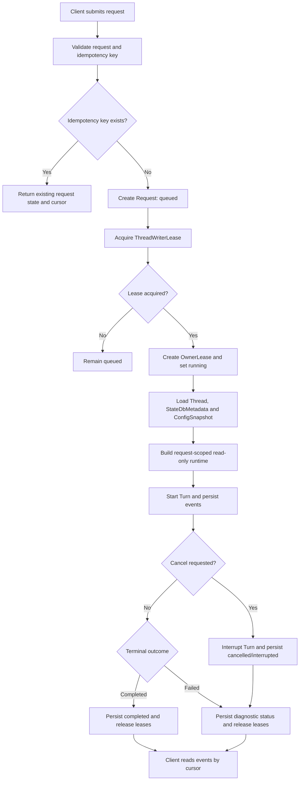

# Codex CLI 无状态服务需求设计

## 1. 业务场景说明

REQ-001 的业务场景是将 Codex CLI 能力提供给云端服务调用方。目标部署形态为几十到上百个 Codex 服务实例。客户端不保持与同一服务实例的长期会话绑定；每次用户输入被建模为一次独立 Request。后续请求可命中任意实例，并基于云端持久化状态恢复同一 Thread 上下文后继续执行。

| 要素 | 内容 | 来源类型 |
| --- | --- | --- |
| 参与方 | 本地 CLI 用户、IDE 或桌面客户端、自动化系统、Codex 服务实例、云端状态存储、只读 exec-server | 需求来源 |
| 触发条件 | 调用方提交一次用户输入、查询请求状态、读取事件或取消运行中请求 | 需求来源 |
| 当前问题 | Codex CLI 当前同时承担交互入口、会话生命周期管理、本地状态读写、工具执行编排和 UI 输出；该模型适合单用户本地终端，不适合多实例服务化 | 需求来源 |
| 期望结果 | 服务实例不依赖进程内长期会话状态完成跨请求正确性；Thread、Request、Turn、Event、ConfigSnapshot 和 StateDbMetadata 等关键状态可从云端状态恢复；执行环境严格只读 | 需求来源 |
| 数据对象 | Thread、Request、Turn、Event、ConfigSnapshot、StateDbMetadata、OwnerLease、ThreadWriterLease、ExecObservation | 推断 |
| 异常路径 | 实例退出、客户端断线、云端状态存储不可用、取消请求、只读执行环境拒绝写入、运行中工具不可恢复 | 需求来源 |

## 2. 目标

### 2.1 总体目标

REQ-002：将 Codex CLI 从以本地交互进程为中心的形态，改造成可由外部客户端按请求调用的无状态服务入口。服务实例不得依赖进程内长期会话状态完成跨请求正确性；请求所需上下文必须由请求参数、云端持久化状态或可重建资源提供。

### 2.2 具体目标

| ID | 目标 | 成功标准 | 来源类型 |
| --- | --- | --- | --- |
| REQ-003 | 支持外部客户端提交单次对话请求、查询请求状态、流式读取结果、取消运行中请求 | 对应接口具备稳定请求、响应、错误和事件模型；客户端 SSE 断线不改变 Request 状态 | 需求来源 |
| REQ-004 | 支持任意实例处理同一线程的后续请求 | 第 N 次请求完成后，第 N+1 次请求命中其他实例仍可恢复上下文 | 需求来源 |
| REQ-005 | 明确区分请求状态、可持久化业务状态和临时运行状态 | 每类状态有所有者、持久化策略和失效语义 | 需求来源 |
| REQ-006 | 保留本地 CLI 命令入口 | 不新增 single-run 参数，复用现有 `codex exec` 作为非交互入口 | 需求来源 |
| REQ-007 | 提供严格只读 Runtime | App-Server 主机、远程 exec-server workspace 和检索挂载不得被工具或模型驱动能力写入 | 需求来源 |

## 3. 范围边界

### 3.1 当前版本范围

- 定义无状态服务的产品和系统需求边界。
- 定义 Thread、Request、Turn、Event、ConfigSnapshot、StateDbMetadata、OwnerLease、ThreadWriterLease 和 ReadOnlyExecEnvironment 等核心实体和状态。
- 定义请求进入、恢复上下文、执行 turn、写入事件、完成持久化、释放进程内对象的生命周期要求。
- 定义云端状态存储、事件读取、幂等重试、同线程串行化、取消和严格只读执行环境的需求。
- 定义 `codex exec` 作为非交互单次执行入口的服务化要求。

### 3.2 非目标

- 不要求首个版本提供多租户 SaaS 能力。
- 不要求首个版本重写模型调用。
- 不要求将全部交互式 TUI 能力完整映射为远程服务能力。
- 不要求运行中任务跨实例接管。运行中任务可以绑定到创建或调度它的 owner 实例。
- 不要求 PTY、shell session、MCP 会话跨实例恢复。实例失效时，相关临时运行状态可中断或失败。
- 不启用 sub-agent 或多 agent 编排能力。
- 不允许任何执行环境写入业务状态；云端状态存储是 Runtime 的持久化边界。

## 4. 现状分析

### 4.1 当前线程与会话模型

当前 `ThreadManagerState` 持有 `HashMap<ThreadId, Arc<CodexThread>>`。`send_op` 通过 `get_thread` 查找进程内线程后提交操作。因此，当前运行态请求处理依赖进程内线程映射。[代码证据：`codex-rs/core/src/thread_manager.rs`](../../../../codex-rs/core/src/thread_manager.rs)

当前 `Codex` 持有 `tx_sub`、`rx_event`、`session` 和后台 `session_loop_termination`。`Codex::submit` 为一次提交生成 ID 后发送到 `tx_sub`，由后台 session loop 处理。因此，当前 turn 执行路径是长生命周期 session 内的提交队列模型。[代码证据：`codex-rs/core/src/session/mod.rs`](../../../../codex-rs/core/src/session/mod.rs)

### 4.2 当前 app-server 协议模型

现有 v2 协议已包含 `thread/start`、`thread/resume`、`turn/start`、`turn/steer`、`turn/interrupt`、`thread/turns/list` 和 `thread/turns/items/list`。`TurnStartParams` 以 `thread_id` 和 `input` 为核心输入，`TurnStartResponse` 返回 `Turn`。现有 `TurnStatus` 为 `Completed`、`Interrupted`、`Failed`、`InProgress`。[代码证据：`codex-rs/app-server-protocol/src/protocol/v2/turn.rs`](../../../../codex-rs/app-server-protocol/src/protocol/v2/turn.rs)

现有协议没有独立的 `Request` 外层资源，也没有 `queued`、`cancelling`、`cancelled`、`owner_timed_out`、`lease_lost` 等请求级状态。引入无状态请求模型时，必须明确 `Request` 与现有 `Turn` 的关系。[推断]

### 4.3 当前持久化模型

当前 thread store 支持 `LocalThreadStore` 和 `InMemoryThreadStore`。本地 thread store 依赖本地 rollout 目录和可选 SQLite state runtime。`state` crate 使用 SQLite 管理 thread metadata、goals、memory、logs 等本地状态。[代码证据：`codex-rs/core/src/thread_manager.rs`](../../../../codex-rs/core/src/thread_manager.rs)、[`codex-rs/state/src/migrations.rs`](../../../../codex-rs/state/src/migrations.rs)

`ThreadMetadata` 包含本地 rollout path、cwd、model、approval mode、sandbox policy、token usage、git 信息等字段。该结构可作为云端 thread metadata 的输入参考，但其中 `rollout_path` 是本地路径，不可作为跨实例业务状态的唯一索引。[代码证据：`codex-rs/state/src/model/thread_metadata.rs`](../../../../codex-rs/state/src/model/thread_metadata.rs)

### 4.4 当前可写执行面与严格只读 Runtime 冲突

当前 app-server 文档暴露了多类可能写入执行环境的能力：`thread/shellCommand` 被标注为 unsandboxed full access；`command/exec`、`process/spawn`、`fs/writeFile`、`fs/createDirectory`、`fs/remove`、`fs/copy` 等接口可直接作用于本地或远程环境；默认 agent prompt 仍要求使用 `apply_patch` 修改文件。[代码证据：`codex-rs/app-server/README.md`](../../../../codex-rs/app-server/README.md)、[`codex-rs/protocol/src/prompts/base_instructions/default.md`](../../../../codex-rs/protocol/src/prompts/base_instructions/default.md)

因此，仅将 `ThreadStore` 改为云端实现不能满足严格只读 Runtime。必须保证所有模型可调用的文件系统、shell、process、patch、hook 和 MCP 能力都不能写入 App-Server 主机、exec-server workspace 或检索挂载。允许写入的对象仅限云端状态存储；这些写入必须由 Runtime 系统代码完成，而不是模型可执行环境完成。[推断]

### 4.5 当前 `codex exec` 生命周期能力

当前 `codex exec` 是非交互 CLI 入口。执行时它会启动 in-process app-server client，调用 `thread/start` 或 `thread/resume`，随后调用 `turn/start` 并等待终态。进程退出后，in-process app-server、`CodexThread`、listener 和本次 turn 内部对象会随进程释放。[代码证据：`codex-rs/exec/src/lib.rs`](../../../../codex-rs/exec/src/lib.rs)

该能力可作为单次执行入口，但不等价于云端 Runtime 无状态化。原因包括：默认持久化仍可能落在本地 session 或 state_db；进程退出不自动提供 CloudThreadStore、云端事件日志、writer lease、跨实例 resume 或严格只读执行边界。[推断]

## 5. 必须新增或扩展的能力

- 新增云端状态存储抽象，覆盖 Thread、Request、Turn、Event、ConfigSnapshot、StateDbMetadata、OwnerLease 和 ThreadWriterLease。[推断]
- 新增请求级 `Request` 资源，或明确将请求状态折叠进 `Turn` 的方案。[推断]
- 新增同线程串行化和 owner 实例租约机制，避免多实例并发执行同一线程 turn。[推断]
- 扩展 `ThreadStore` 写入接口或其调用上下文，使 `append_items` 具备 writer lease、fencing token 和幂等键校验；当前 `AppendThreadItemsParams` 仅包含 `thread_id` 和 `items`，不足以表达多实例写入仲裁。[代码证据]
- 新增事件持久化和游标读取能力，用于读取完整事件；客户端 SSE 断线不改变 Request 状态。[需求来源]
- 新增幂等键存储和重复请求判定规则。[推断]
- 新增只读 exec-server 运行模式。`command/exec` 可保留为只读脚本执行能力，但必须强制路由到只读 exec-server，且禁止回退到 App-Server 主机执行。[需求来源]

## 6. 实体、主要流程和关键状态

### 6.1 实体

| ID | 实体 | 说明 | 持久化要求 | 来源类型 |
| --- | --- | --- | --- | --- |
| ENT-001 | Thread | 逻辑会话，跨请求 resume 的主业务对象 | 云端持久化；以 `threadId` 查询 | 需求来源 |
| ENT-002 | Request | 一次客户端提交的服务请求，承载幂等键、调用方、输入摘要和状态 | 云端持久化；以 `requestId` 和 `idempotencyKey` 查询 | 推断 |
| ENT-003 | Turn | 一次模型执行轮次，可由 Request 创建或驱动 | 云端持久化；以 `turnId` 查询 | 代码证据 |
| ENT-004 | Event | 请求或 turn 产生的结构化输出事件 | 云端持久化；按请求内序号和游标读取 | 需求来源 |
| ENT-005 | ConfigSnapshot | 本次请求使用的配置解析结果或可重建配置输入 | 云端持久化；绑定 Request 和 Thread | 需求来源 |
| ENT-006 | StateDbMetadata | 现有 state_db 承载的 thread metadata、goal、memory mode、backfill state 等元数据 | 云端 DB | 需求来源 |
| ENT-007 | OwnerLease | 运行中请求的 owner 实例租约 | 云端持久化；用于取消、超时和失败诊断 | 推断 |
| ENT-008 | ThreadWriterLease | 同线程写入租约和 fencing token | 云端持久化；所有 Thread append 和 Request 状态写入必须校验 | 推断 |
| ENT-009 | ReadOnlyExecEnvironment | 只读脚本执行环境，通常由 exec-server 提供 | 不持久化；workspace、检索挂载不可写 | 需求来源 |
| ENT-010 | ExecObservation | 只读命令、检索或脚本执行的结构化观察结果 | 作为 Event 或 ToolOutput 持久化 | 推断 |

### 6.2 主要流程

### 6.3 RequestStatus

| ID | 状态 | 进入条件 | 说明 | 来源类型 |
| --- | --- | --- | --- | --- |
| ST-001 | queued | 请求通过校验但尚未获得 ThreadWriterLease | 可等待同线程前序请求结束 | 推断 |
| ST-002 | running | 获得 ThreadWriterLease 和 OwnerLease 后开始执行 | owner 实例负责当前 Turn | 需求来源 |
| ST-003 | cancelling | 调用方主动取消 | 客户端 SSE 断线本身不进入该状态 | 需求来源 |
| ST-004 | completed | Turn 正常完成且关键状态写入成功 | 终态 | 需求来源 |
| ST-005 | failed | 模型、只读工具、配置、环境、持久化或内部错误不可继续 | 终态 | 需求来源 |
| ST-006 | cancelled | 调用方取消被确认 | 终态 | 需求来源 |
| ST-007 | interrupted | 服务端执行被中断或临时运行状态丢失 | 终态 | 需求来源 |
| ST-008 | owner_timed_out | OwnerLease 超过 3 分钟未续期 | 终态；当前 Turn 不恢复 | 需求来源 |
| ST-009 | lease_lost | ThreadWriterLease 丢失或 `runtime/writeDenied` | 终态；当前实例停止执行 | 需求来源 |
| ST-010 | turn_timed_out | Turn 执行超过业务超时 | 终态 | 推断 |

### 6.4 状态闭环规则

| 场景 | 闭环规则 | 来源类型 |
| --- | --- | --- |
| 幂等重试 | 相同调用方、线程和幂等键命中已存在 Request 时，不创建新 Request 或 Turn；返回原 Request 当前状态和 latest cursor | 推断 |
| 客户端 SSE 断线 | 不改变 Request 状态；客户端可通过事件游标读取已持久化事件 | 需求来源 |
| 客户端主动取消 | 取消操作幂等；最终进入 cancelled、failed 或 completed，取决于取消与执行完成的竞态判定规则 | 推断 |
| 服务实例异常退出 | 已完成写入的事件和状态可查询；运行中不可恢复状态进入 interrupted 或 owner_timed_out | 需求来源 |
| 云端状态写入失败 | 不得向调用方确认 completed；请求进入 failed 或保持可诊断的非终态等待恢复 | 需求来源 |
| 同线程并发请求 | 默认串行化；后续请求 queued；不得并发修改同一 Thread 上下文 | 需求来源 |
| 写入租约丢失 | 当前实例停止写入和执行；Request 进入 lease_lost | 需求来源 |

## 7. 功能点列表

| ID | 来源类型 | 功能点 | 参与方 | 优先级 | 输入 | 输出 | 验收标准 |
| --- | --- | --- | --- | --- | --- | --- | --- |
| FR-001 | 需求来源 | 单次请求提交 | 客户端、服务实例 | P0 | threadId 或 createThread、input、idempotencyKey | requestId、turnId、threadId、status、eventCursor | 合法请求创建 Request；重复幂等键不创建重复 Turn |
| FR-002 | 推断 | 请求级幂等 | 客户端、云端状态存储 | P0 | callerId、threadId、idempotencyKey | 已有 Request 或新建 Request | 客户端重试不会重复执行已确认请求 |
| FR-003 | 需求来源 | 任意节点 resume | 服务实例、云端状态存储 | P0 | threadId、Request 输入、ConfigSnapshot、StateDbMetadata | 等价模型上下文 | 第 N+1 次请求命中其他实例可继续执行 |
| FR-004 | 需求来源 | 云端状态持久化 | 服务实例、云端状态存储 | P0 | Thread、Request、Turn、Event、ConfigSnapshot、StateDbMetadata | 可查询状态和事件 | 删除本地状态后仍可查询已确认状态 |
| FR-005 | 需求来源 | 事件持久化与游标读取 | 客户端、服务实例 | P0 | requestId、cursor、limit | events、nextCursor | 客户端可从 cursor 读取已持久化事件 |
| FR-006 | 需求来源 | 同线程串行化与租约 | 服务实例、云端状态存储 | P0 | threadId、requestId、ownerInstanceId | lease 状态 | 同一线程默认不会并发执行两个 running Request |
| FR-007 | 需求来源 | 取消运行中请求 | 客户端、owner 实例 | P1 | requestId、reason | terminal status | 取消操作幂等并写入最终状态 |
| FR-008 | 需求来源 | 严格只读 Runtime | 模型、服务实例、exec-server | P0 | readOnlyRuntimeProfile、execServerEnvironment | 只读工具结果或结构化写入拒绝错误 | 所有执行环境写入尝试失败，且不会改变 App-Server 主机、exec-server workspace 或检索挂载 |
| FR-009 | 需求来源 | CLI 兼容入口 | 本地 CLI 用户 | P1 | `codex exec` 输入、服务地址或内嵌服务配置 | 等价退出状态和结构化结果 | 非交互 CLI 可经服务路径完成；不新增 single-run 参数 |
| FR-010 | 推断 | Thread writer lease 与 fencing | 服务实例、云端状态存储 | P0 | threadId、requestId、fencingToken、appendIdempotencyKey | append success 或 fencing conflict | 过期 owner 或非 owner 实例不能追加同一 Thread 的 canonical items |

## 8. 角色与权限

| 角色 | 允许操作 | 禁止操作 | 权限失败行为 | 来源类型 |
| --- | --- | --- | --- | --- |
| 本地 CLI 用户 | 提交请求、读取自身线程事件、取消自身请求 | 访问未授权线程或其他调用方请求；在 Runtime 内直接写入 workspace | 返回权限错误 | 需求来源 |
| IDE 或桌面客户端 | 提交请求、订阅事件、分页读取历史 | 绕过只读 Runtime | 返回权限错误 | 需求来源 |
| 自动化系统 | 非交互提交、查询状态、取消请求、读取机器可解析结果 | 使用交互式 TUI-only 能力；依赖跨 turn shell session | 返回结构化不支持错误 | 需求来源 |
| 服务实例 | 获取租约、执行 turn、写入云端事件和云端状态 | 无租约时修改 running Request；写入任何执行环境；将 command/exec 回退到 App-Server 主机 | 拒绝写入、触发 fencing conflict 或返回结构化环境错误 | 推断 |
| 只读 exec-server | 执行只读脚本、命令、检索和观察任务 | 写入 workspace、检索挂载；保留跨 turn 可变状态 | 返回只读文件系统错误或结构化工具错误 | 需求来源 |

权限提升不得跨请求隐式复用，除非存在显式持久化授权策略。当前 Runtime 设计不覆盖审批编排；如果外围审批系统允许某次工具调用继续执行，Runtime 仍必须维持只读执行边界。[需求来源]

## 9. 数据口径

| 字段 | 口径 | 默认值和空值语义 | 来源类型 |
| --- | --- | --- | --- |
| requestId | 单次服务请求全局唯一标识 | 服务端生成；不能为空 | 推断 |
| turnId | 模型执行轮次标识 | 请求进入 running 前后创建；若幂等命中则返回原值 | 推断 |
| threadId | 跨请求 resume 的主业务键 | 新线程创建时生成；后续请求必填 | 需求来源 |
| idempotencyKey | 客户端重试去重键 | 同一调用方和线程范围内唯一；缺失时不得提供幂等保证 | 推断 |
| eventCursor | 事件读取游标 | 初始为空或服务端返回首游标；不表达业务顺序之外的含义 | 推断 |
| eventSequence | 请求内事件序号 | 从 1 单调递增；跨请求不要求全局顺序 | 需求来源 |
| ConfigSnapshot | 请求实际使用的配置结果或可重建输入 | 必须绑定 requestId；不得仅依赖启动时配置 | 需求来源 |
| writerLeaseId | Thread writer lease 标识 | running Request 获得租约后生成；append 时必须校验 | 推断 |
| fencingToken | writer lease 的单调 fencing token | 过期或较旧 token 不得写入 Thread canonical items | 推断 |
| singleRunMode | 是否使用单次执行模式 | 表示每次调用仅执行一个 turn；首版复用 `codex exec`，不新增参数名 | 需求来源 |
| runtimeWriteDenied | 只读 Runtime 写入拒绝计数或事件 | 初始为 0；发生写入尝试时记录结构化错误 | 推断 |
| expiresAt | 租约或请求超时时间 | 使用服务端时间 | 推断 |

列表接口默认使用 cursor pagination：请求包含 `cursor` 和 `limit`，响应包含 `data` 和 `nextCursor`。排序方向需要在接口层显式定义；事件默认按请求内序号升序读取。[推断]

## 10. 前端交互操作流程

无新增 TUI 页面要求。服务化接口主要面向 CLI、IDE、桌面客户端和自动化系统。现有交互式 TUI 可保留本地执行路径。[需求来源]

IDE 或桌面客户端的服务交互流程如下：[推断]

1. 客户端提交单次请求。
2. 客户端收到 `requestId`、`turnId`、初始 `status` 和 `eventCursor`。
3. 客户端按 cursor 订阅或轮询事件。
4. 客户端主动取消时调用取消接口。
5. 客户端 SSE 断线不改变 Request 状态；重新连接后使用 cursor 读取已持久化事件。
6. 请求进入终态后，客户端使用最后确认的 cursor 读取已持久化事件，并展示最终结果、错误、取消或中断状态。

必要 UI 状态包括 loading、empty event stream、cancel pending、completed、failed、cancelled、interrupted、owner_timed_out、lease_lost、turn_timed_out。具体 UI 样式和页面不在本需求范围内。[推断]

## 11. 接口草案

接口命名仅用于需求表达，最终名称以 API 设计为准。首版建议新增 Request 外层资源，例如 `request/run`、`request/read`、`request/events/list`、`request/cancel`。

| 能力 | 关键输入 | 关键输出 | 来源类型 |
| --- | --- | --- | --- |
| 单次请求运行 | threadId 或 createThread、idempotencyKey、input、cwd、settings、permissionProfile、clientInfo | requestId、turnId、threadId、status、eventCursor | 需求来源 |
| 状态读取 | requestId 或 turnId | request、latestEventCursor | 需求来源 |
| 事件读取 | requestId、turnId、cursor、limit | events、nextCursor | 需求来源 |
| 取消请求 | requestId、turnId、reason | status | 需求来源 |
| Runtime capability 读取 | clientInfo、requestedMode | supportedModes、readOnlyRuntimeRequired、disabledCapabilities | 推断 |

## 12. 待确认问题

当前需求层只保留首版无状态运行闭环所需的实现细节。

| ID | 问题 | 影响 | 来源类型 |
| --- | --- | --- | --- |
| Q-001 | 服务协议复用现有 app-server JSON-RPC，还是定义面向自动化的新资源层 | 决定 API 命名和 Request/Turn 映射 | 待确认 |
| Q-002 | 单次请求接口复用 `turn/start`，还是新增 Request/task API | 决定 Request 与 Turn 的状态映射 | 待确认 |
| Q-003 | 云端状态持久化复用现有 thread/turn/item 模型，还是新增 Request 作为 Turn 外层记录 | 决定幂等、队列和状态查询模型 | 待确认 |
| Q-004 | 同一线程并发请求是排队、拒绝还是允许 steer | 决定锁模型和客户端错误语义 | 待确认 |
| Q-005 | 运行中 owner 实例失联后的 Request 是立即 interrupted，还是先等待租约过期 | 决定故障恢复时延和误判风险 | 待确认 |
| Q-006 | 事件持久化失败但模型执行已完成时，最终状态如何表达 | 决定 completed 确认边界 | 待确认 |
| Q-007 | 只读 exec-server 的临时目录是否允许内存态 scratch，还是完全禁止写入 | 决定脚本执行能力和隔离成本 | 待确认 |

## 13. 验收标准汇总

| ID | 验收标准 | 关联功能点 | 来源类型 |
| --- | --- | --- | --- |
| AC-001 | 合法单次请求创建 Request，并返回 requestId、turnId、threadId、status、eventCursor | FR-001 | 需求来源 |
| AC-002 | 重复提交相同幂等键不会创建重复 Request 或 Turn | FR-001, FR-002 | 需求来源 |
| AC-003 | 客户端重试不会重复执行已确认请求 | FR-002 | 需求来源 |
| AC-004 | 同一线程第 N 次用户输入完成后，第 N+1 次用户输入命中其他实例，可基于 threadId 恢复上下文并继续执行 | FR-003 | 需求来源 |
| AC-005 | 单次请求、turn、事件、配置快照和 state_db 元数据写入云端持久化层；本地状态删除后仍可查询已确认状态 | FR-004 | 需求来源 |
| AC-006 | 请求进入终态后，客户端可基于事件游标读取已持久化输出；running 状态 SSE 断线不改变 Request 状态 | FR-005 | 需求来源 |
| AC-007 | 同一线程默认不会并发执行两个 running Request | FR-006 | 需求来源 |
| AC-008 | 取消操作幂等；最终状态写入云端持久化层 | FR-007 | 需求来源 |
| AC-009 | 所有执行环境写入尝试失败，且不会改变 App-Server 主机、exec-server workspace 或检索挂载 | FR-008 | 需求来源 |
| AC-010 | 非交互 CLI 调用可通过服务路径完成，并复用 `codex exec` 入口 | FR-009 | 需求来源 |
| AC-011 | 过期 owner 或非 owner 实例不能追加同一 Thread 的 canonical items | FR-010 | 推断 |
