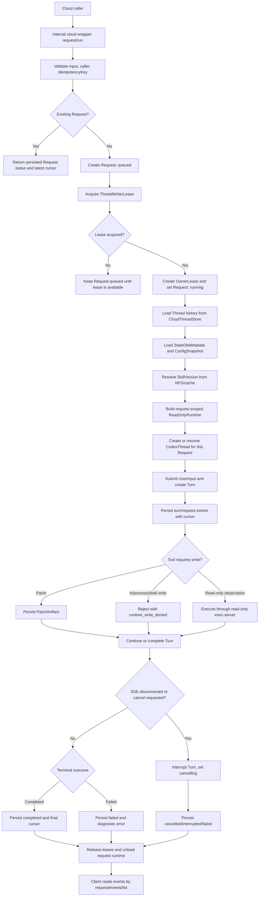
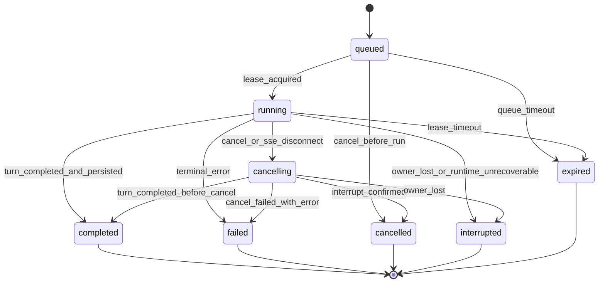
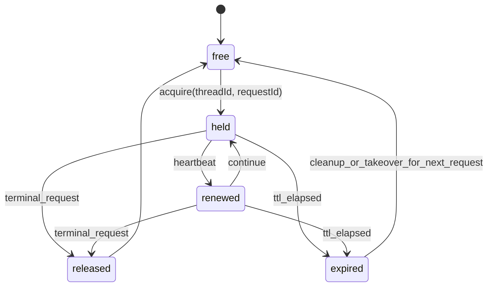

# Codex CLI 无状态服务技术方案设计

## 1. 需求简述

REQ-001 的目标是将 Codex CLI/app-server 能力改造成可由外部客户端按单次请求调用的无状态服务入口。服务实例可横向扩展到几十至上百个节点；一次用户输入对应一次 Request；Request 运行期间允许绑定 owner 实例；Request 结束后，后续请求必须能由任意兼容实例基于云端状态恢复同一 Thread 上下文并继续执行。[需求来源]

本方案基于上游需求文档 `dev_harness/design/versions/20260604_v0.1_stateless/stateless-codex-cli-requirements-design.md` 和可行性分析 `dev_harness/arch/versions/20260604_v0.1_stateless/stateless-service-feasibility-analysis.md`。本文不定义多租户 SaaS、运行中跨实例接管、运行中 SSE 重新 attach、PTY/shell/MCP 会话恢复、sub-agent 或多 agent 编排能力。[需求来源]

核心约束如下：

| ID | 约束 | 处理方式 | 来源类型 |
| --- | --- | --- | --- |
| CON-001 | 服务实例不得依赖进程内长期业务状态完成跨请求正确性 | Request 入口从云端 Thread、State、SkillVersion 和 ConfigSnapshot 重建运行上下文；终态后释放 request-scoped runtime | 需求来源 |
| CON-002 | 运行中 Request 可绑定 owner 实例 | 使用 OwnerLease 表达 owner、心跳、超时和取消路由；实例异常不做跨实例接管 | 需求来源 |
| CON-003 | 同一 Thread 默认串行执行 | 使用 ThreadWriterLease 和 fencing token 保护 Request 状态写入、Turn 写入和 canonical item append | 需求来源 |
| CON-004 | Runtime 严格只读 | 云端 Runtime 下禁用或拒绝写入型 fs/process/shell 能力；`command/exec` 只允许只读 exec-server，不允许 App-Server 主机 fallback | 需求来源 |
| CON-005 | 文件修改输出为 PatchArtifact | `apply_patch` 类能力在云端 Runtime 中不写 workspace，只生成可审计 artifact | 需求来源 |
| CON-006 | Skill 权威源为 NFS | 请求启动时解析并记录 SkillVersion；本地 Skill cache 可丢弃，NFS 版本指纹为追溯依据 | 需求来源 |
| CON-007 | 内部云端 wrapper API 优先 | 首版 Request API 作为云端服务内部 wrapper 协议，不作为公开 app-server experimental v2 API 首发；如需进入 app-server，仍必须使用 v2 类型和 schema | 需求来源 |
| CON-008 | 避免扩大 `codex-core` | 云端状态实现优先放入新 crate 或现有非 core crate；`codex-core` 只保留必要 trait 接入和运行时调用点 | 代码规则 |

设计结论：采用新增 Request 外层资源的方案，首版定位为内部云端 wrapper API。Request 负责幂等、排队、取消、事件游标、owner lease 和终态查询；Turn 保持模型执行轮次语义。该方案避免把 queued、cancelling、cancelled、expired 等请求级状态强行折叠进现有 `TurnStatus`。[需求来源]

## 2. 涉及实体

| ID | 实体 | 所有者 | 持久化 | 说明 | 来源类型 |
| --- | --- | --- | --- | --- | --- |
| ENT-001 | Thread | CloudThreadStore | 云端 DB 和事件日志 | 跨请求 resume 的主业务对象，主键为 `threadId` | 需求来源 |
| ENT-002 | Request | CloudStateStore | 云端 DB | 一次客户端提交，承载幂等键、状态、owner、输入摘要、错误和游标 | 需求来源 |
| ENT-003 | Turn | ThreadStore 和事件投影 | 云端 DB 或从事件投影 | 一次模型执行轮次，兼容现有 app-server `Turn` | 代码证据 |
| ENT-004 | Event | EventLogStore | 云端事件日志 | Request/Turn 产生的持久化事件，按 request 内序号读取 | 需求来源 |
| ENT-005 | ConfigSnapshot | CloudStateStore | 云端 DB 或对象存储 | Request 实际使用的配置解析结果或可重建配置输入 | 需求来源 |
| ENT-006 | StateDbMetadata | CloudStateStore | 云端 DB | 迁移现有 SQLite state_db 中 thread metadata、goal、memory mode、backfill state 等职责 | 需求来源 |
| ENT-007 | SkillVersion | SkillVersionStore | 云端 DB | Skill root、skill id、fingerprint、解析错误和绑定 request 记录 | 需求来源 |
| ENT-008 | SkillCacheEntry | SkillCacheManager | 本地可丢弃缓存和可选状态记录 | NFS 到本地缓存的物化记录，缓存不作为业务事实源 | 需求来源 |
| ENT-009 | OwnerLease | CloudStateStore | 云端 DB | running Request 的 owner 实例、租约、心跳和失效诊断 | 推断 |
| ENT-010 | ThreadWriterLease | CloudStateStore | 云端 DB | 同 Thread 写入租约和 fencing token | 推断 |
| ENT-011 | PatchArtifact | ArtifactStore | 云端对象存储和元数据 | 模型提出的文件修改产物，替代 Runtime 内直接写入 | 需求来源 |
| ENT-012 | ReadOnlyExecEnvironment | exec-server | 不持久化 | 只读脚本执行环境，workspace、NFS Skill 源、检索挂载和临时目录不可写 | 需求来源 |
| ENT-013 | ExecObservation | EventLogStore | 云端事件日志 | 只读命令、检索或脚本执行的结构化观察结果 | 推断 |
| ENT-014 | RuntimeCapabilityProfile | app-server/core | 配置快照和事件记录 | 云端 Runtime 的能力集合，强制只读且禁用 sub-agent | 需求来源 |

## 3. 核心链路流程图

流程结论：`request/run` 是内部云端 wrapper 的主入口，`thread/resume` 在该入口内部执行；进程内 `ThreadManagerState.threads` 只能作为运行期 registry，不能作为后续请求正确性的必要条件。是否将该 wrapper API 后续公开为 app-server v2 experimental API，属于后续兼容性决策。[需求来源]

## 4. 状态变更图

### 4.1 Request 状态机

| ID | 状态 | 说明 | 现有 TurnStatus 映射 | 来源类型 |
| --- | --- | --- | --- | --- |
| ST-001 | queued | Request 已创建但未获得同 Thread 执行租约 | 无 | 推断 |
| ST-002 | running | owner 实例已获得租约并开始执行 | `InProgress` | 需求来源 |
| ST-003 | cancelling | 取消、SSE 断线或调度终止已发起 | `InProgress` 或 `Interrupted` | 推断 |
| ST-004 | completed | Turn 正常完成，关键状态和事件已持久化 | `Completed` | 代码证据 |
| ST-005 | failed | 模型、环境、状态存储或内部错误导致失败 | `Failed` | 代码证据 |
| ST-006 | cancelled | 调用方取消或 SSE 断线触发取消并确认 | `Interrupted` 或新增 `Cancelled` 投影 | 需求来源 |
| ST-007 | interrupted | owner 实例退出或临时运行态丢失 | `Interrupted` | 需求来源 |
| ST-008 | expired | 排队、运行或取消超过租约/超时策略 | 无或 `Failed` 投影 | 推断 |

### 4.2 ThreadWriterLease 状态机

租约结论：所有 Thread canonical item append、Request terminal status 写入和事件终态确认必须校验 `requestId`、`leaseId`、`fencingToken` 和 append 幂等键。过期 owner 或较旧 fencing token 不得追加 canonical items。[推断]

## 5. 现有关联代码分析

| ID | 文件或模块 | 当前行为 | 与方案关系 | 来源类型 |
| --- | --- | --- | --- | --- |
| CA-001 | `codex-rs/core/src/thread_manager.rs` | `ThreadManagerState` 持有 `HashMap<ThreadId, Arc<CodexThread>>`，`get_thread` 只从进程内 map 查找 | `request/run` 需要新增“按 thread id 从 store 恢复并执行”的路径；现有 map 保留为 running registry | 代码证据 |
| CA-002 | `codex-rs/core/src/thread_manager.rs::thread_store_from_config` | 当前只支持 `LocalThreadStore` 与 `InMemoryThreadStore` | 需要新增 cloud-backed store 配置和实现接入 | 代码证据 |
| CA-003 | `codex-rs/thread-store/src/store.rs` | `ThreadStore` 已覆盖 create/resume/append/flush/read/list/archive 等 | 作为 CloudThreadStore 主扩展点；需补充 lease/fencing/append 幂等上下文 | 代码证据 |
| CA-004 | `codex-rs/thread-store/src/types.rs` | `AppendThreadItemsParams` 只有 `thread_id` 和 `items` | 多实例写入缺少 writer lease、fencing token、append idempotency key | 代码证据 |
| CA-005 | `codex-rs/app-server-protocol/src/protocol/v2/turn.rs` | `TurnStartParams` 以 `thread_id` 和 `input` 为核心，`TurnStatus` 只有 completed/interrupted/failed/inProgress | Request 生命周期不能完整表达在 TurnStatus 内 | 代码证据 |
| CA-006 | `codex-rs/app-server/src/request_processors/turn_processor.rs` | `turn_start_inner` 先 `load_thread(&params.thread_id)`，再向 loaded thread 提交 `Op::UserInput` | 当前 `turn/start` 依赖线程已加载；无状态入口需要内部 resume 或新 processor | 代码证据 |
| CA-007 | `codex-rs/app-server/src/thread_state.rs` 和 `thread_status.rs` | 维护 listener、pending resume、thread status、watch channel 等进程内连接状态 | 保留为运行中连接状态；不能作为终态查询和跨请求恢复来源 | 代码证据 |
| CA-008 | `codex-rs/state/src/migrations.rs` 和 `state/src/model/*` | SQLite migrations 覆盖 state、logs、goals、memories；`ThreadMetadata` 包含本地 `rollout_path` | 需要抽象成云端 state service；`rollout_path` 仅作为 local compatibility 字段 | 代码证据 |
| CA-009 | `codex-rs/core-skills/src/loader.rs` | `SkillRoot` 已携带 `ExecutorFileSystem`，loader 集中扫描 `SKILL.md` | 可接入 NFS 或缓存文件系统；需要增加 fingerprint 与缓存元数据 | 代码证据 |
| CA-010 | `codex-rs/core-skills/src/model.rs` | `SkillMetadata` 没有版本指纹；`SkillLoadOutcome` 是加载结果和进程内 cache 输入 | 需要新增 `SkillVersion` 并将其绑定到 Request | 代码证据 |
| CA-011 | `codex-rs/app-server/src/skills_watcher.rs` | 本地 file watcher 触发 `skills_manager.clear_cache()` 和 `skills/changed` | NFS 场景不能依赖本地 watcher，需 TTL、主动刷新和版本指纹 | 代码证据 |
| CA-012 | `codex-rs/app-server-protocol/src/protocol/common.rs` | 暴露 `fs/writeFile`、`fs/createDirectory`、`fs/remove`、`fs/copy`、`command/exec`、`process/spawn` 等 | 云端 Runtime 必须按 capability profile 禁用、拒绝或重路由 | 代码证据 |
| CA-013 | `codex-rs/app-server/src/request_processors/command_exec_processor.rs` | `command/exec` 基于 app-server 配置和本机 sandbox 构建 exec request | 云端只读模式需要改为强制 read-only exec-server；缺失时拒绝，不 fallback | 代码证据 |
| CA-014 | `codex-rs/core/src/apply_patch.rs` | `apply_patch` 安全检查后可 `DelegateToRuntime`，由 runtime 实际写文件 | 云端 Runtime 下改为生成 PatchArtifact；不调用写文件 runtime | 代码证据 |
| CA-015 | `codex-rs/protocol/src/prompts/base_instructions/default.md` | 默认指令要求模型使用 `apply_patch` 编辑文件 | 云端 Runtime 需要条件化注入 PatchArtifact 指令，避免模型预期直接写 workspace | 代码证据 |
| CA-016 | `codex-rs/core/src/client.rs` | `ModelClientSession` 明确是 turn-scoped，包含 WebSocket 和 sticky routing token | 支持 Request 结束释放 turn-scoped model client，禁止跨 turn 复用 | 代码证据 |
| CA-017 | `codex-rs/exec/src/lib.rs` | `codex exec` 使用 in-process app-server client 执行非交互 turn | 可作为 single-run 迁移入口，但不能替代云端状态、lease 和只读 Runtime | 代码证据 |
| CA-018 | `codex-rs/core/src/session/*` 和 `codex-rs/core/src/tools/*` | 存在 hook、MCP、sub-agent、tool registry、spawn_agent 等多类工具入口 | ReadOnlyRuntimeProfile 必须统一约束这些入口，避免绕过 | 代码证据 |

## 6. 代码变更范围

### 6.1 协议层

| ID | 文件或模块 | 变更 | 关联功能点 | 来源类型 |
| --- | --- | --- | --- | --- |
| CH-001 | 新 crate 或云端服务模块 `codex-cloud-wrapper-protocol` | 新增 Request DTO、RequestStatus、request run/read/events/cancel 参数和响应 | FR-001, FR-002, FR-005, FR-007, FR-014 | 需求来源 |
| CH-002 | 新 crate 或云端服务模块 `codex-cloud-wrapper-protocol` | 新增 PatchArtifact DTO、读取参数和响应 | FR-013 | 需求来源 |
| CH-003 | 新 crate 或云端服务模块 `codex-cloud-wrapper-protocol` | 新增 runtime capabilities DTO 和禁用能力列表 | FR-008 | 需求来源 |
| CH-004 | 新 crate 或云端服务模块 `codex-cloud-wrapper-protocol` | 新增 Skill cache 状态和刷新接口 DTO；app-server `plugin.rs` 仅在需要透传时扩展 Skill metadata 版本字段 | FR-010, FR-011 | 需求来源 |
| CH-005 | `codex-rs/app-server-protocol/src/protocol/common.rs` | 首版不注册公开 `request/*` RPC；仅当后续决定公开为 app-server v2 experimental API 时注册方法、serialization scope 和 schema | FR-001 至 FR-015 | 需求来源 |
| CH-006 | wrapper 协议测试；可选 `codex-rs/app-server-protocol/src/protocol/v2/tests.rs` | 内部 wrapper DTO 序列化测试；若透传到 app-server，再补 v2 JSON/TS schema 测试 | FR-001 至 FR-015 | 需求来源 |

### 6.2 app-server 层

| ID | 文件或模块 | 变更 | 关联功能点 | 来源类型 |
| --- | --- | --- | --- | --- |
| CH-101 | `codex-rs/app-server/src/request_processors/request_processor.rs` | 新增 Request 生命周期 processor，协调幂等、租约、恢复、执行、取消和终态写入 | FR-001, FR-002, FR-003, FR-006, FR-007, FR-014 | 推断 |
| CH-102 | 云端 wrapper service；可选 `codex-rs/app-server/src/message_processor.rs` | wrapper 调用 app-server 内部能力；首版不要求 app-server 对外接入 Request RPC，保留现有 `turn/start` 兼容路径 | FR-001, FR-009 | 需求来源 |
| CH-103 | `codex-rs/app-server/src/request_processors/turn_processor.rs` | 抽取可复用的“loaded thread 提交 turn”内部函数，供 request processor 调用 | FR-001, FR-003 | 推断 |
| CH-104 | `codex-rs/app-server/src/request_processors/command_exec_processor.rs` | 云端只读模式下拒绝本机 exec，强制路由 read-only exec-server | FR-008 | 需求来源 |
| CH-105 | `codex-rs/app-server/src/request_processors/fs_processor.rs` | 云端只读模式下拒绝写入型 fs RPC；读类 RPC 可按权限保留 | FR-008 | 需求来源 |
| CH-106 | `codex-rs/app-server/src/skills_watcher.rs` 和 catalog processor | 增加 SkillVersion 返回、cache 状态读取、主动刷新入口 | FR-010, FR-011 | 推断 |
| CH-107 | `codex-rs/app-server/src/thread_state.rs` 和 watch manager | running SSE 断线触发 Request cancel，不提供重新 attach | FR-005, FR-014 | 需求来源 |
| CH-108 | `codex-rs/app-server/README.md` | 更新 v2 API、只读 Runtime、PatchArtifact、Skill cache 和兼容约束 | FR-001 至 FR-015 | 代码规则 |

### 6.3 core 和存储层

| ID | 文件或模块 | 变更 | 关联功能点 | 来源类型 |
| --- | --- | --- | --- | --- |
| CH-201 | `codex-rs/thread-store/src/store.rs` | 增加 append 写入上下文，或新增 lease-aware append trait | FR-003, FR-004, FR-006, FR-015 | 推断 |
| CH-202 | 新 crate `codex-cloud-state` 或等价 crate | 实现 Request、Event、OwnerLease、ThreadWriterLease、PatchArtifact metadata、SkillVersion 状态接口 | FR-001 至 FR-015 | 推断 |
| CH-203 | `codex-rs/core/src/thread_manager.rs` | 新增 request-scoped resume/load/run/release 边界；配置接入 CloudThreadStore | FR-003, FR-004 | 推断 |
| CH-204 | `codex-rs/state/src` | 抽象 SQLite state_db 职责，保留 SQLite 本地实现并新增云端实现 | FR-004 | 需求来源 |
| CH-205 | `codex-rs/core/src/apply_patch.rs` 和工具 runtime | 在 ReadOnlyRuntimeProfile 下返回 PatchArtifact invocation，不执行写文件 | FR-008, FR-013 | 需求来源 |
| CH-206 | `codex-rs/core/src/tools/registry.rs` 和 tool exposure | 按 RuntimeCapabilityProfile 禁用 write tools、sub-agent、可写 MCP/hook 入口 | FR-008 | 需求来源 |
| CH-207 | `codex-rs/core-skills/src` | 扩展 SkillMetadata/LoadOutcome 中版本和 source/cache 信息 | FR-010, FR-011 | 推断 |
| CH-208 | 新 crate `codex-skill-cache` 或 `codex-rs/core-skills/src/cache.rs` | 实现 NFS 到本地缓存物化、hash、TTL、互斥刷新、原子替换 | FR-010, FR-011 | 推断 |
| CH-209 | `codex-rs/protocol/src/prompts/base_instructions/default.md` 或运行时附加指令 | 云端只读模式下注入 PatchArtifact 指令，避免直接 workspace 修改预期 | FR-013 | 推断 |

### 6.4 CLI 层

| ID | 文件或模块 | 变更 | 关联功能点 | 来源类型 |
| --- | --- | --- | --- | --- |
| CH-301 | `codex-rs/exec/src/cli.rs` | 增加 single-run/print 模式参数或新子命令；不得占用现有 `-p`，除非另有兼容决策 | FR-009 | 需求来源 |
| CH-302 | `codex-rs/exec/src/lib.rs` | 支持连接云端 app-server 或使用 request/run；输出保持 JSONL/退出码兼容 | FR-009 | 推断 |
| CH-303 | `codex-rs/cli/src` 或主入口 | 若新增云端 wrapper，提供服务地址、认证、超时和 retry 配置 | FR-009 | 推断 |

### 6.5 明确不应修改的范围

| ID | 范围 | 原因 | 来源类型 |
| --- | --- | --- | --- |
| NC-001 | app-server v1 API | 新 API 应发生在 v2 | 代码规则 |
| NC-002 | `CODEX_SANDBOX_NETWORK_DISABLED_ENV_VAR` 和 `CODEX_SANDBOX_ENV_VAR` 相关代码 | 项目规则禁止修改 | 代码规则 |
| NC-003 | `codex-core` 中新增完整云端数据库客户端 | 避免继续扩大 `codex-core`；通过 trait 和新 crate 接入 | 代码规则 |
| NC-004 | sub-agent 功能实现增强 | 当前版本明确禁用，不新增多 agent 能力 | 需求来源 |

## 7. 新逻辑定义

### 7.1 实体定义

| ID | 实体 | 关键字段 | 约束 | 来源类型 |
| --- | --- | --- | --- | --- |
| DATA-001 | `RequestRecord` | `request_id`、`thread_id`、`caller_id`、`idempotency_key`、`status`、`turn_id`、`owner_instance_id`、`latest_event_cursor`、`created_at`、`updated_at`、`expires_at` | `(caller_id, thread_id, idempotency_key)` 唯一；终态不可回退 | 推断 |
| DATA-002 | `RequestInputSnapshot` | `request_id`、`input_hash`、`input_redacted_summary`、`client_info`、`cwd`、`settings_hash` | 用于幂等冲突诊断；不得存储未授权敏感内容 | 推断 |
| DATA-003 | `TurnRecord` | `turn_id`、`request_id`、`thread_id`、`status`、`started_at`、`completed_at`、`error_kind` | 可投影为现有 v2 `Turn` | 推断 |
| DATA-004 | `EventRecord` | `request_id`、`turn_id`、`sequence`、`event_type`、`payload_ref`、`payload_inline`、`created_at` | `(request_id, sequence)` 唯一；按 sequence 升序读取 | 需求来源 |
| DATA-005 | `ThreadWriterLeaseRecord` | `thread_id`、`lease_id`、`request_id`、`fencing_token`、`owner_instance_id`、`expires_at` | `fencing_token` 单调递增；append 必须校验 | 推断 |
| DATA-006 | `OwnerLeaseRecord` | `request_id`、`owner_instance_id`、`heartbeat_at`、`expires_at`、`cancel_requested_at` | owner 失联后 Request 进入 interrupted 或 expired | 推断 |
| DATA-007 | `ConfigSnapshotRecord` | `request_id`、`thread_id`、`config_hash`、`effective_permissions`、`runtime_profile`、`serialized_ref` | Request 执行时绑定；后续追溯使用 | 需求来源 |
| DATA-008 | `SkillVersionRecord` | `skill_root`、`skill_id`、`fingerprint`、`source_mtime`、`source_size`、`loaded_at`、`errors` | Request 绑定实际使用 fingerprint | 需求来源 |
| DATA-009 | `SkillCacheEntryRecord` | `cache_key`、`source_root`、`fingerprint`、`cache_path`、`expires_at`、`last_refresh_error` | 本地可丢弃；状态用于诊断 | 需求来源 |
| DATA-010 | `PatchArtifactRecord` | `artifact_id`、`request_id`、`turn_id`、`thread_id`、`base_revision`、`target_paths`、`content_hash`、`object_ref` | patch 内容不可变；应用 patch 不在 Runtime 内执行 | 需求来源 |
| DATA-011 | `StateDbMetadataRecord` | `thread_id`、`kind`、`payload`、`schema_version`、`updated_at` | 覆盖 goal、memory mode、backfill 等本地 SQLite 职责 | 需求来源 |

### 7.2 接口定义

| ID | RPC 方法 | 请求 | 响应 | 语义 | 来源类型 |
| --- | --- | --- | --- | --- | --- |
| IF-001 | wrapper `request/run` | `threadId?`、`createThread?`、`input`、`idempotencyKey`、`cwd?`、`settings?`、`permissions?`、`clientInfo?`、`singleRunMode?` | `request`、`turn?`、`threadId`、`eventCursor` | 内部云端 wrapper 创建或幂等命中 Request；内部获取租约、resume、执行 turn | 需求来源 |
| IF-002 | wrapper `request/read` | `requestId` | `request`、`latestEventCursor` | 查询 Request 当前状态和游标 | 需求来源 |
| IF-003 | wrapper `request/events/list` | `requestId`、`cursor?`、`limit?` | `data`、`nextCursor` | 终态后读取完整事件；running SSE 断线不重新 attach | 需求来源 |
| IF-004 | wrapper `request/cancel` | `requestId`、`reason?` | `request` | 幂等取消；若 running 则路由 owner interrupt | 需求来源 |
| IF-005 | wrapper `artifact/patch/read` | `patchArtifactId` 或 `requestId + artifactId` | `metadata`、`content` 或 `downloadRef` | 读取 PatchArtifact | 需求来源 |
| IF-006 | wrapper `runtime/capabilities/read` | `requestedMode?`、`clientInfo?` | `supportedModes`、`disabledCapabilities`、`readOnlyRuntimeRequired` | 云端调用方判断可用能力和限制 | 需求来源 |
| IF-007 | wrapper `skill/cache/status/read` | `skillRoot?`、`skillId?` | `data`、`nextCursor?` | 读取本地缓存和权威版本状态 | 需求来源 |
| IF-008 | wrapper `skill/cache/refresh` | `skillRoot?`、`skillId?`、`expectedVersion?`、`force?` | `previousVersion`、`currentVersion`、`cacheStatus` | 主动刷新 Skill cache | 需求来源 |
| IF-009 | app-server `turn/start` | 现有 `TurnStartParams` | 现有 `TurnStartResponse` | 兼容保留；内部 wrapper 可调用或复用其处理逻辑 | 代码证据 |
| IF-010 | app-server `thread/resume` | 现有 `ThreadResumeParams` | 现有 `ThreadResumeResponse` | 兼容保留；wrapper 内部执行 resume | 代码证据 |

内部 trait 和函数契约如下：

| ID | 接口 | 位置 | 契约 | 来源类型 |
| --- | --- | --- | --- | --- |
| IF-101 | `CloudRequestStore` | 新 crate | create_or_get_by_idempotency、update_status、heartbeat_owner、request_cancel、read | 推断 |
| IF-102 | `EventLogStore` | 新 crate | append_event(request_id, seq, payload)、list_events(cursor, limit) | 推断 |
| IF-103 | `LeaseStore` | 新 crate | acquire_thread_writer_lease、renew_owner_lease、release、validate_fencing_token | 推断 |
| IF-104 | `ArtifactStore` | 新 crate | put_patch_artifact、read_patch_artifact、verify_hash | 推断 |
| IF-105 | `CloudStateRuntime` | `codex-rs/state` 或新 crate | 替代 SQLite-only StateDbHandle 直接依赖，提供 thread metadata、goal、memory、backfill 接口 | 推断 |
| IF-106 | `SkillCacheManager` | `core-skills` 或新 crate | resolve_skill_versions、materialize_cache、refresh、status | 推断 |
| IF-107 | `ReadOnlyRuntimeProfile` | core/app-server | 决定可注册工具、可执行环境和 write deny 策略 | 需求来源 |
| IF-108 | `PatchArtifactRuntimeInvocation` | core tool runtime | 接收 apply_patch action，返回 artifact metadata，不写文件 | 推断 |

### 7.3 数据库定义

存储实现待定。首版建议使用强一致关系型数据库承载 Request、Lease、SkillVersion 和 artifact metadata，使用对象存储承载大 payload 和 PatchArtifact 内容，使用 append-only 事件表或事件日志承载 EventRecord。[推断]

| ID | 表或集合 | 主键 | 唯一约束 | 重要索引 | 来源类型 |
| --- | --- | --- | --- | --- | --- |
| DB-001 | `threads` | `thread_id` | 无 | `updated_at`、`caller_id`、`archived_at` | 需求来源 |
| DB-002 | `thread_items` | `item_id` | `(thread_id, append_sequence)`、`append_idempotency_key` | `thread_id, append_sequence` | 推断 |
| DB-003 | `requests` | `request_id` | `(caller_id, thread_id, idempotency_key)` | `thread_id, status`、`owner_instance_id` | 推断 |
| DB-004 | `turns` | `turn_id` | `(request_id, turn_id)` | `thread_id, created_at` | 推断 |
| DB-005 | `events` | `event_id` | `(request_id, sequence)` | `request_id, sequence`、`turn_id` | 需求来源 |
| DB-006 | `thread_writer_leases` | `thread_id` | `lease_id` | `expires_at`、`owner_instance_id` | 推断 |
| DB-007 | `owner_leases` | `request_id` | 无 | `owner_instance_id`、`expires_at` | 推断 |
| DB-008 | `config_snapshots` | `request_id` | `config_hash` 可重复 | `thread_id`、`config_hash` | 需求来源 |
| DB-009 | `state_metadata` | `(thread_id, kind)` | 无 | `updated_at`、`schema_version` | 需求来源 |
| DB-010 | `skill_versions` | `(skill_root, skill_id, fingerprint)` | 无 | `skill_id, loaded_at` | 需求来源 |
| DB-011 | `request_skill_versions` | `(request_id, skill_root, skill_id)` | 无 | `fingerprint` | 需求来源 |
| DB-012 | `patch_artifacts` | `artifact_id` | `content_hash` 可重复 | `request_id`、`turn_id`、`thread_id` | 需求来源 |

数据库写入规则：

| ID | 规则 | 来源类型 |
| --- | --- | --- |
| DBR-001 | `requests.status` 只能按 Request 状态机前进；终态不可回退 | 推断 |
| DBR-002 | `thread_items` append 必须提交当前 `lease_id` 和 `fencing_token` | 推断 |
| DBR-003 | `events.sequence` 由 owner 实例在 Request 范围内单调递增；重复 append 使用幂等键去重 | 推断 |
| DBR-004 | 向客户端确认 completed 前，Turn terminal event、Request terminal status 和必要 Thread append 必须持久化成功 | 需求来源 |
| DBR-005 | PatchArtifact 内容写入对象存储后再写 metadata；metadata 中保存 content hash | 推断 |
| DBR-006 | Skill cache 本地目录不参与业务恢复；Request 只信任 `request_skill_versions` | 需求来源 |

### 7.4 消息定义

| ID | 消息或通知 | 方向 | 字段 | 语义 | 来源类型 |
| --- | --- | --- | --- | --- | --- |
| MSG-001 | `request/started` | server notification | `requestId`、`threadId`、`turnId?`、`status`、`eventCursor` | Request 获得执行权或开始运行 | 推断 |
| MSG-002 | `request/statusChanged` | server notification | `requestId`、`fromStatus`、`toStatus`、`reason?` | 状态变化通知 | 推断 |
| MSG-003 | `request/eventAppended` | event log and optional stream | `requestId`、`sequence`、`event`、`cursor` | 持久化事件游标 | 需求来源 |
| MSG-004 | `request/completed` | server notification | `requestId`、`turnId`、`finalCursor` | completed 终态 | 推断 |
| MSG-005 | `request/failed` | server notification | `requestId`、`errorKind`、`errorCode`、`finalCursor` | failed/interrupted/expired 诊断 | 推断 |
| MSG-006 | `artifact/patchCreated` | event log | `artifactId`、`contentHash`、`targetPaths`、`summary` | PatchArtifact 创建 | 需求来源 |
| MSG-007 | `runtime/writeDenied` | event log | `toolName`、`target`、`reason`、`capability` | 只读 Runtime 拒绝写入 | 需求来源 |
| MSG-008 | `skill/versionBound` | event log | `skillId`、`skillRoot`、`fingerprint` | Request 绑定 SkillVersion | 需求来源 |
| MSG-009 | `lease/lost` | internal | `requestId`、`leaseId`、`fencingToken` | owner 或 writer lease 失效 | 推断 |

消息兼容规则：现有 `turn/started`、`item/*`、`turn/completed` 可继续向旧客户端发送。无状态客户端以 Request 事件为主，必要时从 Event payload 中读取兼容 Turn/Item 投影。[推断]

## 8. 变更影响和测试范围

### 8.1 功能点映射

| 功能点 | 代码变更 | 接口 | 状态 | 数据 | 来源类型 |
| --- | --- | --- | --- | --- | --- |
| FR-001 单次请求提交 | CH-001, CH-101, CH-103, CH-203 | IF-001 | ST-001 至 ST-008 | DATA-001 至 DATA-004 | 需求来源 |
| FR-002 请求级幂等 | CH-101, CH-202 | IF-001, IF-002 | ST-001 | DATA-001, DB-003 | 推断 |
| FR-003 任意节点 resume | CH-201, CH-203, CH-204 | IF-001 | ST-002 | DATA-003, DATA-011 | 需求来源 |
| FR-004 云端状态持久化 | CH-202, CH-204 | IF-002, IF-003 | ST-004 至 ST-008 | DB-001 至 DB-012 | 需求来源 |
| FR-005 事件持久化与游标读取 | CH-001, CH-101, CH-202 | IF-003 | ST-004 至 ST-008 | DATA-004, DB-005 | 需求来源 |
| FR-006 同线程串行化与 owner 租约 | CH-101, CH-202, CH-201 | IF-001 | Lease 状态机 | DATA-005, DATA-006 | 需求来源 |
| FR-007 取消运行中请求 | CH-101, CH-107 | IF-004 | ST-003, ST-006, ST-007 | DATA-001, DATA-006 | 需求来源 |
| FR-008 严格只读 Runtime | CH-104, CH-105, CH-205, CH-206 | IF-006 | ST-005 或继续 running | DATA-013, MSG-007 | 需求来源 |
| FR-009 CLI 兼容入口 | CH-301, CH-302, CH-303 | IF-001, IF-009 | ST-001 至 ST-008 | DATA-001 | 需求来源 |
| FR-010 NFS Skill 加载 | CH-106, CH-207, CH-208 | IF-007, IF-008 | ST-002 | DATA-008 | 需求来源 |
| FR-011 Skill 本地缓存与失效 | CH-106, CH-208 | IF-007, IF-008 | ST-002 | DATA-008, DATA-009 | 需求来源 |
| FR-012 结构化错误和观测 | CH-101, CH-202 | IF-002, IF-003 | ST-005 至 ST-008 | MSG-005, MSG-007 | 需求来源 |
| FR-013 PatchArtifact 输出 | CH-002, CH-205, CH-209 | IF-005 | ST-002 或 ST-004 | DATA-010, DB-012 | 需求来源 |
| FR-014 运行中 SSE 断线取消 | CH-101, CH-107 | IF-003, IF-004 | ST-003, ST-006, ST-007 | DATA-001, MSG-002 | 需求来源 |
| FR-015 Thread writer lease 与 fencing | CH-201, CH-202 | 内部接口 IF-103 | Lease 状态机 | DATA-005, DB-006 | 推断 |

### 8.2 测试范围

| ID | 测试类型 | 目标 | 建议位置 | 来源类型 |
| --- | --- | --- | --- | --- |
| TC-001 | app-server protocol serialization | Request、PatchArtifact、Runtime、Skill cache DTO JSON/TS schema 正确 | `codex-rs/app-server-protocol/src/protocol/v2/tests.rs` | 代码规则 |
| TC-002 | schema generation | v2 schema fixture 包含新增 API | `just write-app-server-schema` 后验证 | 代码规则 |
| TC-003 | core integration | 第 N 次请求完成后删除本地 runtime registry，第 N+1 次请求从 CloudThreadStore 恢复 | `codex-rs/core/suite` 或 `codex-rs/core/src/thread_manager_tests.rs` | 需求来源 |
| TC-004 | idempotency | 相同 caller/thread/idempotencyKey 不重复创建 Request/Turn | app-server request processor tests | 需求来源 |
| TC-005 | lease fencing | 过期 owner 或旧 fencing token append 失败 | cloud state store tests | 推断 |
| TC-006 | SSE disconnect | running SSE 断线触发 cancelling 并进入终态；不支持重新 attach | app-server transport/request tests | 需求来源 |
| TC-007 | read-only fs/process | 云端 Runtime 下写入型 fs/process/shell RPC 被拒绝 | app-server processor tests | 需求来源 |
| TC-008 | command/exec routing | read-only exec-server 缺失时不 fallback 到 App-Server 主机 | command exec processor tests | 需求来源 |
| TC-009 | PatchArtifact | `apply_patch` 在 ReadOnlyRuntimeProfile 下生成 artifact 且 workspace 不变 | core apply_patch/tool runtime tests | 需求来源 |
| TC-010 | Skill fingerprint | Request 记录实际使用 Skill 指纹；刷新后新 Request 使用新指纹 | core-skills/app-server tests | 需求来源 |
| TC-011 | state_db cloud abstraction | goal、memory mode、metadata 从云端状态恢复 | state/core integration tests | 需求来源 |
| TC-012 | CLI compatibility | `codex exec` 服务路径输出、退出码、JSONL 兼容 | `codex-rs/exec` tests | 需求来源 |

测试执行规则：协议变更后运行 `just write-app-server-schema` 和 `just test -p codex-app-server-protocol`；core 或 thread store 变更后运行对应 crate 的 `just test -p <crate>`；影响 common/core/protocol 时再评估完整 `just test`，完整测试需另行确认。[代码规则]

## 9. 新增配置和对外依赖说明

| ID | 配置 | 默认值 | 说明 | 来源类型 |
| --- | --- | --- | --- | --- |
| CFG-001 | `cloud_runtime.enabled` | `false` | 启用无状态服务 Runtime | 推断 |
| CFG-002 | `cloud_runtime.state_store` | 无 | 云端状态服务或数据库连接配置引用 | 推断 |
| CFG-003 | `cloud_runtime.artifact_store` | 无 | PatchArtifact 对象存储配置引用 | 推断 |
| CFG-004 | `cloud_runtime.runtime_profile` | `read_only` | 云端模式强制 `read_only`，不可被 Request 降级为可写 | 需求来源 |
| CFG-005 | `cloud_runtime.owner_lease_ttl_ms` | 待确认 | owner 租约 TTL | 待确认 |
| CFG-006 | `cloud_runtime.thread_writer_lease_ttl_ms` | 待确认 | 同 Thread 写入租约 TTL | 待确认 |
| CFG-007 | `cloud_runtime.request_timeout_ms` | 待确认 | Request 总超时 | 待确认 |
| CFG-008 | `cloud_runtime.sse_disconnect_policy` | `cancel_turn` | running SSE 断线处理策略，首版固定取消或中断 | 需求来源 |
| CFG-009 | `cloud_runtime.disable_subagents` | `true` | 云端 Runtime 禁用 sub-agent | 需求来源 |
| CFG-010 | `exec_server.read_only.required` | `true` | `command/exec` 必须路由只读 exec-server | 需求来源 |
| CFG-011 | `exec_server.read_only.environment_id` | 无 | 只读 exec-server 环境标识 | 推断 |
| CFG-012 | `skills.nfs_roots` | 空 | NFS Skill 权威源列表 | 需求来源 |
| CFG-013 | `skills.cache_dir` | 待确认 | 本地 Skill cache 根目录 | 推断 |
| CFG-014 | `skills.cache_ttl_ms` | 待确认 | Skill cache TTL | 需求来源 |
| CFG-015 | `skills.fingerprint_strategy` | `directory_merkle` 或待确认 | 版本指纹策略 | 待确认 |
| CFG-016 | `cli.service_endpoint` | 无 | CLI 服务路径 endpoint | 推断 |
| CFG-017 | `cli.single_run_mode` | `false` | 非交互单次执行模式；参数名待决策 | 需求来源 |

外部依赖如下：

| ID | 依赖 | 用途 | 失败语义 | 来源类型 |
| --- | --- | --- | --- | --- |
| DEP-001 | 云端强一致 DB 或状态服务 | Request、Lease、Thread metadata、SkillVersion、artifact metadata | 创建或终态写入失败时不得确认 completed | 需求来源 |
| DEP-002 | 云端对象存储 | PatchArtifact 和大事件 payload | 写入失败时 Request failed 或重试 | 需求来源 |
| DEP-003 | NFS Skill 源 | Skill 权威源 | 缓存可用时按策略继续；缓存不可用或过期时结构化失败 | 需求来源 |
| DEP-004 | read-only exec-server | 只读脚本执行和观察 | 缺失时 `command/exec` 返回环境错误，不 fallback | 需求来源 |
| DEP-005 | 模型服务 | Turn 执行 | 保持现有模型错误语义并持久化 failed event | 代码证据 |

## 10. 高级主题

### 10.1 设计决策记录

| ID | 来源类型 | 问题 | 选项 | 决策 | 理由 | 代价 |
| --- | --- | --- | --- | --- | --- | --- |
| DDR-001 | 需求来源 | 单次请求接口是否复用 `turn/start` | A 扩展 `turn/start`；B 新增内部 wrapper `request/run`；C 公开 app-server experimental v2 `request/run` | 选择 B | Request 需要 queued、cancelling、cancelled、expired、幂等和事件游标；现有 TurnStatus 不足。首版作为内部云端 wrapper，可降低公开 API 兼容承诺 | 新增内部协议面；后续若公开到 app-server v2 需要补 schema、README 和客户端兼容策略 |
| DDR-002 | 推断 | ThreadStore 是否直接承载所有 Request 状态 | A 扩展 ThreadStore；B 新增 CloudStateStore 并与 CloudThreadStore 协作 | 选择 B | ThreadStore 语义是线程历史；Request、Lease、Artifact 和 SkillVersion 不是纯线程历史 | 增加一个状态边界 |
| DDR-003 | 需求来源 | command/exec 缺少只读 exec-server 时如何处理 | A fallback 本机；B 返回环境错误 | 选择 B | fallback 会使 App-Server 主机成为可写执行节点 | 部分旧客户端在云端模式下失败 |
| DDR-004 | 需求来源 | `apply_patch` 在云端 Runtime 中如何处理 | A 继续写 workspace；B 生成 PatchArtifact | 选择 B | 严格只读 Runtime 禁止执行环境写入 | 需要客户端或外部流程应用 patch |
| DDR-005 | 推断 | Skill cache 失效粒度 | A 全量 clear；B root/skill/fingerprint 版本化 | 选择 B | Request 需要可追溯实际 Skill 版本 | 缓存实现复杂度增加 |
| DDR-006 | 需求来源 | running SSE 断线是否重新 attach | A 允许 attach；B 取消或中断当前 Request | 选择 B | 首版明确不支持运行中重新 attach | 客户端断线会造成当前 turn 终止 |
| DDR-007 | 代码规则 | 云端状态实现放置位置 | A 加入 `codex-core`；B 新 crate 或现有非 core crate | 选择 B | 避免扩大 codex-core，符合项目规则 | trait 和 crate 边界需要设计 |
| DDR-008 | 需求来源 | CLI single-run 是否复用 `-p` | A 复用 `-p`；B 新增长参数或新子命令；C 迁移 profile 短参数 | 暂定 B | 当前 `-p` 已用于 `--profile`，直接复用存在兼容冲突 | 与 Claude Code 参数不完全一致 |
| DDR-009 | 需求来源 | 同 Thread 并发请求如何处理 | A 排队；B 直接返回 busy/conflict；C 允许并发执行 | 选择 A | 同一 Thread 上下文需要串行追加 canonical items；排队能保留客户端提交语义并避免调用方自行重试 | 需要队列超时、队列长度限制和调度观测 |

### 10.2 迁移与回滚方案

| 阶段 | 迁移动作 | 回滚方式 | 验证 | 来源类型 |
| --- | --- | --- | --- | --- |
| MIG-001 | 新增内部 wrapper 协议 DTO，默认不启用 cloud_runtime | 移除 feature flag 或禁用配置 | wrapper 协议测试；如后续公开到 app-server v2，再补 schema diff | 需求来源 |
| MIG-002 | 实现 CloudStateStore 接口和本地 fake/in-memory 实现 | 切回 LocalThreadStore 和 SQLite state_db | 单元和集成测试 | 推断 |
| MIG-003 | 引入 Request processor，但旧 `turn/start` 保持原路径 | 客户端切回旧 API | 双路径测试 | 推断 |
| MIG-004 | 增加 lease-aware append，LocalThreadStore 可接受本地兼容 no-op lease | 配置关闭 cloud store | append 兼容测试 | 推断 |
| MIG-005 | 抽象 state_db，SQLite 保留为本地实现 | 配置切回 SQLite | goal/memory/metadata 测试 | 需求来源 |
| MIG-006 | 启用 ReadOnlyRuntimeProfile 和 PatchArtifact | 关闭 cloud_runtime 或切回本地 profile | 写入拒绝和 artifact 测试 | 需求来源 |
| MIG-007 | 启用 NFS Skill root 和 cache | 切回本地 Skill roots | Skill version 测试 | 需求来源 |
| MIG-008 | CLI 使用 `request/run` 服务路径 | CLI 配置切回 in-process app-server | exec CLI 兼容测试 | 需求来源 |

回滚原则：cloud_runtime 未启用时不得改变本地 TUI、旧 app-server 客户端和 `codex exec` 默认语义。涉及数据库 schema 的迁移必须支持向前兼容读取；旧二进制读取新 DB 的行为需按现有 state migrator 的 ignore-missing 思路评估，但云端 DB 的兼容策略仍待确认。[推断]

### 10.3 并发与幂等

| ID | 场景 | 规则 | 来源类型 |
| --- | --- | --- | --- |
| CI-001 | 客户端重复提交 | `(caller_id, thread_id, idempotency_key)` 命中时返回原 Request；若输入 hash 不一致，返回 idempotency conflict | 推断 |
| CI-002 | 同 Thread 并发请求 | 默认只允许一个 running Request；后续 Request 进入 queued，不返回 busy；租约释放后按创建时间和调度策略推进 | 需求来源 |
| CI-003 | owner 心跳延迟 | 心跳未过期时非 owner 不得接管 running Request；过期后只允许将旧 Request 标记 interrupted/expired，不恢复执行 | 需求来源 |
| CI-004 | append 重试 | 使用 append idempotency key 去重；重复 append 返回成功但不重复写 item | 推断 |
| CI-005 | fencing 冲突 | 非当前 fencing token 的 append 和 terminal 写入失败，记录 conflict metric | 推断 |
| CI-006 | 取消与完成竞态 | 若 completed 已持久化，cancel 返回 completed；若 interrupt 先确认，则进入 cancelled/interrupted | 推断 |
| CI-007 | Skill 刷新与 running Request | running Request 继续使用启动时 SkillVersion；刷新只影响新 Request | 需求来源 |
| CI-008 | 事件写入乱序 | owner 按 sequence append；读取端只按 sequence 升序返回，缺口视为非终态或存储错误 | 推断 |

### 10.4 错误处理和降级策略

| ID | 错误类型 | 状态影响 | 客户端响应 | 来源类型 |
| --- | --- | --- | --- | --- |
| ERR-001 | invalid_request | 不创建 Request 或 existing Request 不变 | JSON-RPC invalid params/bad request | 代码证据 |
| ERR-002 | idempotency_conflict | 不创建新 Request | 结构化 conflict，包含已有 requestId 和 input hash 差异摘要 | 推断 |
| ERR-003 | lease_unavailable | queued | 返回 queued 状态、requestId 和事件游标；由调度器在租约释放后推进 | 需求来源 |
| ERR-004 | state_store_unavailable | queued/running 不得确认 completed | failed 或 retryable error | 需求来源 |
| ERR-005 | event_persist_failed | 不得确认 completed | failed，保留诊断 | 需求来源 |
| ERR-006 | exec_server_unavailable | failed 或 tool error | 环境错误，不 fallback App-Server 主机 | 需求来源 |
| ERR-007 | runtime_write_denied | 通常继续 turn，工具调用返回失败输出 | 事件记录 `runtime/writeDenied` | 需求来源 |
| ERR-008 | nfs_unavailable_cache_valid | 继续执行并记录 degraded | 返回 cache hit with stale source warning | 推断 |
| ERR-009 | nfs_unavailable_cache_invalid | failed | Skill load 环境错误 | 需求来源 |
| ERR-010 | owner_lost | interrupted 或 expired | 终态可查询 | 需求来源 |
| ERR-011 | model_error | failed | 保持现有模型错误映射并持久化 | 代码证据 |
| ERR-012 | patch_artifact_write_failed | failed 或 tool error | 不确认 patch created | 需求来源 |

降级边界：云端 Runtime 不允许从只读 exec-server 降级到 App-Server 主机执行，不允许从 PatchArtifact 降级到 workspace 写入，不允许从 NFS 权威源降级到未校验本地 Skill 内容作为事实源。[需求来源]

### 10.5 观测性

| ID | 类型 | 指标或日志 | 标签 | 来源类型 |
| --- | --- | --- | --- | --- |
| OBS-001 | tracing | request lifecycle span | `request_id`、`thread_id`、`turn_id`、`owner_instance_id` | 需求来源 |
| OBS-002 | metric | `request_status_total` | `status`、`error_kind`、`client` | 推断 |
| OBS-003 | metric | `thread_writer_lease_conflict_total` | `thread_id_hash`、`owner_instance_id` | 推断 |
| OBS-004 | metric | `runtime_write_denied_total` | `tool_name`、`capability`、`target_kind` | 需求来源 |
| OBS-005 | metric | `patch_artifact_created_total` | `content_hash_prefix`、`target_count` | 推断 |
| OBS-006 | metric | `skill_cache_hit_total` / `skill_cache_miss_total` | `root_hash`、`skill_id`、`fingerprint` | 需求来源 |
| OBS-007 | metric | `skill_cache_refresh_duration_ms` | `root_hash`、`status` | 需求来源 |
| OBS-008 | metric | `event_log_append_latency_ms` | `event_type` | 推断 |
| OBS-009 | audit | write denied audit record | caller、request、tool、target、reason | 需求来源 |
| OBS-010 | dashboard | active queued/running/cancelling requests | instance、thread bucket | 推断 |

日志规则：普通日志不得包含完整用户输入、PatchArtifact 内容、credential、NFS path 中的敏感段或完整环境变量。必要诊断使用 hash、摘要或对象引用。[需求来源]

### 10.6 安全与权限影响

| ID | 安全面 | 要求 | 来源类型 |
| --- | --- | --- | --- |
| SEC-001 | 执行环境写入 | App-Server 主机、exec-server workspace、NFS Skill 源、检索挂载和执行临时目录不可写 | 需求来源 |
| SEC-002 | command/exec | 只允许 read-only exec-server；禁止本机 fallback；禁止可写 env 或 cwd 覆盖突破 | 需求来源 |
| SEC-003 | fs RPC | 云端 Runtime 下拒绝 `fs/writeFile`、`fs/createDirectory`、`fs/remove`、`fs/copy` | 需求来源 |
| SEC-004 | process/spawn | 云端 Runtime 下禁用；该接口当前无 sandbox 语义 | 代码证据 |
| SEC-005 | apply_patch | 仅产生 PatchArtifact，不修改文件系统 | 需求来源 |
| SEC-006 | MCP 和 hooks | 注册和调用前经过 RuntimeCapabilityProfile；可写或不确定能力默认禁用 | 推断 |
| SEC-007 | sub-agent | 云端 Runtime 下不注册或拒绝 `spawn_agent`、guardian subagent 和 sub-agent hooks | 需求来源 |
| SEC-008 | Skill NFS | NFS root 只读挂载；cache 物化需校验 fingerprint；不得执行未经授权的 skill script 写入 | 需求来源 |
| SEC-009 | 跨调用方访问 | Request、Thread、PatchArtifact 读取必须校验 caller 或租户范围，首版可预留字段 | 需求来源 |
| SEC-010 | PatchArtifact 应用 | 应用 patch 是 Runtime 外部流程，需要独立授权和审计 | 需求来源 |

安全结论：只读 Runtime 是系统级 capability profile，不是单个 sandbox policy。必须在 app-server 协议入口、core tool registry、exec-server、MCP、hook、Skill script 和 patch runtime 同时执行。[推断]

## 11. 待确认问题

| ID | 问题 | 影响 | 来源类型 |
| --- | --- | --- | --- |
| Q-001 | 云端状态存储具体选型 | 决定事务、锁、事件日志和对象存储接口 | 待确认 |
| Q-002 | `OwnerLease` TTL、心跳周期和超时终态 | 决定故障恢复时延和误判概率 | 待确认 |
| Q-003 | `ThreadWriterLease` 是否复用 DB 行锁、租约表还是外部锁服务 | 决定 fencing token 实现 | 待确认 |
| Q-004 | `AppendThreadItemsParams` 直接扩展还是新增 lease-aware append API | 决定 LocalThreadStore 兼容成本 | 待确认 |
| Q-005 | state_db 云端抽象放在 `codex-rs/state` 还是新 crate | 决定 crate 依赖方向 | 待确认 |
| Q-006 | Skill fingerprint 采用目录 Merkle、manifest version 还是文件 hash 集合 | 决定缓存失效成本和精度 | 待确认 |
| Q-007 | 过期但完整性校验通过的 Skill cache 是否允许继续服务 | 决定 NFS 故障下可用性 | 待确认 |
| Q-008 | read-only exec-server 临时目录是否允许内存态 scratch | 决定部分脚本可用性和只读定义 | 待确认 |
| Q-009 | `runtime/writeDenied` 是否作为模型可见 tool output 继续 turn，还是直接 failed | 决定模型恢复能力和用户体验 | 待确认 |
| Q-010 | SSE 断线终态优先使用 `cancelled` 还是 `interrupted` | 决定统计和客户端展示 | 待确认 |
| Q-011 | CLI single-run 参数名称 | 当前 `-p` 已用于 `--profile`，需兼容决策 | 待确认 |
| Q-012 | PatchArtifact 内容格式是 unified diff、apply_patch grammar，还是结构化 file changes | 决定 artifact 校验和外部应用流程 | 待确认 |
| Q-013 | 旧 rollout path thread 如何批量迁移到云端 ThreadStore | 决定历史兼容和回滚范围 | 待确认 |
